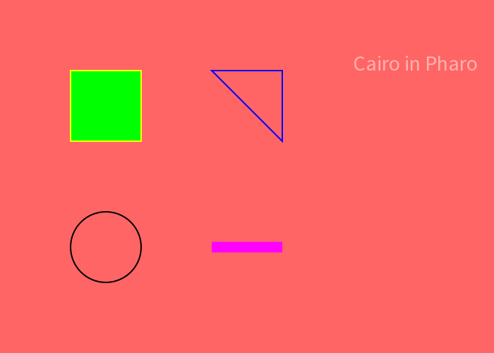
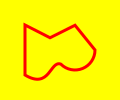
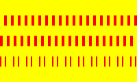
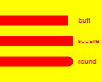
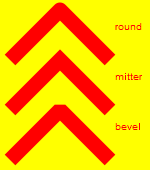
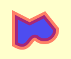
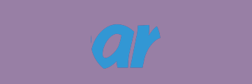

# Alexandrie

In the realm of computer graphics, two fundamental approaches reign: **vector graphics** and **raster graphics**. 

Raster graphics, akin to mosaics, construct images from a multitude of tiny
colored squares called pixels. Each pixel represents a specific point on the
display, contributing to the overall image by its color and position. The
resolution of a raster image, defined by the number of pixels horizontally and
vertically, dictates the level of detail it can capture. Increasing the image
size beyond its original resolution often results in pixelation, a loss of
sharpness and clarity as individual pixels become more prominent. Raster graphics reign supreme in capturing photographic imagery and complex color gradients.

In stark contrast, vector graphics embrace a fundamentally different philosophy.
Instead of relying on a grid of pixels, they utilize geometric primitives such
as points, lines, and curves to represent visual elements. These primitives are
defined by mathematical equations, enabling precise control over their shape,
size, and position. Unlike raster graphics, vector images are
resolution-independent. They can be scaled infinitely without compromising image
quality. They are ideal for logos, illustrations, technical drawings, and any application where maintaining sharp lines and details is crucial.

Historically, Pharo employed two distinct libraries for graphical rendering: **FormCanvas**, utilizing a bitmap-based approach, and **Athens**, specializing in vector graphics. However, the introduction of **Bloc** marks a significant shift, ushering in **Alexandrie**, a cutting-edge vector graphics API specifically designed for the Pharo environment. It leverages the well-established [Cairo graphic library](https://www.cairographics.org/) for the critical rasterization process

Here's a full example. You should be able to understand it before the end of this
chapter.

```smalltalk
| surface context fontFace scaledFont |
surface := AeCairoImageSurface
                extent: 700 @ 500
                format: AeCairoSurfaceFormat argb32.
context := surface newContext.

context
    sourceColor: (Color red alpha: 0.6);
    paint.


"green rectangle"
context
    sourceColor: Color green;
    rectangle: (100 @ 100 extent: 100 @ 100);
    fillPreserve;
    sourceColor: Color yellow;
    stroke.

"draw a blue triangle"
context
    moveTo: 300 @ 100;
    lineTo: 400 @ 100;
    lineTo: 400 @ 200;
    closePath;
    sourceColor: Color blue;
    stroke.

"black circle"
context
    arcCenterX: 150
    centerY: 350
    radius: 50
    startAngle: 0
    endAngle: Float twoPi;
    sourceColor: Color black;
    stroke.

"Thick magenta line"
context
    lineWidth: 15;
    moveTo: 300 @ 350;
    relativeLineTo: 100 @ 0;
    sourceColor: Color magenta;
    stroke.

"some text in white blending in the background"
fontFace := AeCairoFreetypeFontFace newForFace:
                (AeSourceSansPro_Regular firstFaceUsing:
                        AeFTLibrary newInitialized).
scaledFont := fontFace
                    newScaledFontWithFontMatrix:
                    (AeCairoMatrix newScalingBy: 30 asPoint)
                    userToDeviceMatrix: AeCairoMatrix newIdentity
                    options: AeCairoFontOptions new.
context
    sourceColor: (Color white alpha: 0.5);
    translateByX: 500 y: 100.
context
    scaledFont: scaledFont;
    showGlyphs: (scaledFont glyphArrayForString: 'Cairo in Pharo').

^ surface asForm
```



## Destination

The destination is the **surface** on which you're drawing. It may be tied to an
array of pixels like in this tutorial, or it might be tied to SVG or PDF file,
or something else. This surface collects the elements of your graphic as you
apply them, allowing you to build up a complex work as though painting on a
canvas. Most of the time, you'll want to draw on an Image surface. This will
create a new rectangle surface with 32 bit alpha color.

```smalltalk
AeCairoImageSurface
    extent: 120 @ 220
    format: AeCairoSurfaceFormat argb32.
```

Once your drawing is done, you can render your image on a bitmap with
`surface asForm`

## Context

The context keeps track of everything that you want to draw.
It's attached to one surface destination and tracks several variables like line
width and style, font face and size, and more. Most importantly
it tracks the path. Before you can start to draw something with Alexandrie,
you need to create the context, like this:

```smalltalk
context := surface newContext.
```

You can apply many properties to your context like

## Path

The path express the shape you want to draw with a virtual pen. It's then applied
to the destination using the **paint** message.

It's expressed with simple primitive

* **moveTo:** Move to specified location
* **relativeMoveTo:** move to specified location, relative from your starting point.
* **lineTo:** add a line to a specified location
* **relativeLineTo:** add a line, but location is relative from your starting point.
* **arcCenter:radius:startAngle: endAngle:** add a circle with center, radius, start and end angle, clockwise.
* **arcNegativeCenter:radius:startAngle:endAngle:** like arcCenter, but counter-clockwise.
* **curveVia:via:to:** Bezier curve with 3 points.
* **closePath** will connect your last path point to beginning path point.

You can find more method in **AeCairoContext / API - Path** protocol

Here is a full example

```smalltalk
context
    lineWidth: 3;
    moveTo: 25 @ 25;
    lineTo: 50 @ 37.75;
    relativeLineTo: 25 @ -12.5;
    arcCenter: 75 @ 50 radius: 20 startAngle: 0 endAngle: 135 degreesToRadians;
    curveVia: 50 @ 60 via: 50 @ 90 to: 25 @ 75;
    closePath;
    sourceColor: Color red;
    stroke.
```

which result in:



## painting

### Stroke

The **stroke** operation takes a virtual pen along the path in a thin line,
according to the pen's line *width*, *dash* style, and line *caps*.

**lineWidth:** specify the with of the line (obviously)

A dash pattern is specified by an array of positive values.
Each value provides the length of alternate 'on' and 'off' portions of the stroke.
The offset specifies an offset into the pattern at which the stroke begins, like
`dash: (AeFFIDoubleArray newFrom: #( 2 5 2 10 )) offset: 0;`

Some example of different line dash. If you don't specify any, you'll have a
straight line.



Line can be terminated using **useLineCapButt**, **useLineCapRound** or **useLineCapSquare** parameter

* butt: start(stop) the line exactly at the start(end) point
* round: use a round ending, the center of the circle is the end point
* square: use squared ending, the center of the square is the end point



Line can be joined using **useLineJoinRound**, **useLineJoinMiter** or **useLineJoinBevel** drawing.

* mitter: use a sharp (angled) corner.
* round: use a rounded join, the center of the circle is the joint point
* bevel: use a cut-off join, the join is cut off at half the line width from the joint point



Limit on the ratio of the miter length to the width used to draw a miter join
it is possible for the miter to extend far beyond the thickness of the line
stroking the path. the miter limit ratio is used to define when the limit is
exceeded, if so the join is converted from a miter to a bevel.
`useLineJoinMiter; miterLimit: 3;`


### Fill

The **fill** operation instead uses the path like the lines of a coloring
book, and fill it with selected color scheme.

Note that once you *stroke* or *fill* your path, the *context* will forget it.
If you want to keep your path for both *stroke* and *fill* operation, you
should use the **strokePreserve** or **fillPreserve** message.

```smalltalk
"fill first and stroke second. The color of stroke appear on the top of fill"
context
    moveTo: 25 @ 25;
    lineTo: 50 @ 37.75;
    relativeLineTo: 25 @ -12.5;
    arcCenter: 75 @ 50
    radius: 20
    startAngle: 0
    endAngle: 135 degreesToRadians;
    curveVia: 50 @ 60 via: 50 @ 90 to: 25 @ 75;
    closePath;
    sourceColor: (Color blue alpha: 0.7);
    fillPreserve.


context
    lineWidth: 10;
    sourceColor: (Color red alpha: 0.5);
    stroke.
```



### color

You can select different color style to paint your path:

* Single color
  
```smalltalk
"plain color fill"
context sourceColor: (Color yellow alpha: 0.2);
```

* Linear gradient

```smalltalk
"linear gradient fill"
gradient := AeCairoLinearGradientPattern
                from: 0 @ 0
                to: 100 @ 100
                addStopsFrom: {
                        (0 -> Color white).
                        (1 -> Color black) }.
context source: gradient;
```

* Radial gradient

```smalltalk
"Radial gradient fill"
gradient := AeCairoRadialGradientPattern
                innerCenter: 50 @ 50
                innerRadius: 50
                outerCenter: 80 @ 80
                outerRadius: 0
                addStopsFrom: {
                        (0 -> Color black).
                        (1 -> Color white) }.

context source: gradient.
```

* Bitmap.
  
```smalltalk
form := AeCairoImageSurface fromForm:
            PolymorphSystemSettings pharoLogoForm.
context sourceSurface: form x: 0 y: 0
```

The **stroke** and **fill** message with use the source color specified and apply it
to your path.

A full example with all color possibilities:  


## transformation

Your path can be transformed in multiple way before being applied to your
destination, by manipulating the transformation matrix.

* **translateBy:** Modifies the current transformation matrix by translating the user-space origin by a Point.
* **scaleBy:** Modifies the current transformation matrix by scaling the X and Y user-space axes. The scaling of the axes takes place after any existing transformation of user space.
* **rotateByRadians:** Modifies the current transformation matrix by rotating the user-space axes by angle radians.
* **setIdentityMatrix** Resets the current transformation matrix by setting it equal to the identity matrix.

## Mask and clip

### Mask

The **mask** operations allow transfer according to the transparency/opacity of
a second source pattern or surface. Where the pattern or surface is opaque,
the current source is transferred to the destination.
Where the pattern or surface is transparent, nothing is transferred.

```smalltalk
form := PolymorphSystemSettings pharoLogoForm.
pattern := AeCairoSurfacePattern surface:
                (AeCairoImageSurface fromForm: form).

"paint the background in purple, et let the mask appear in alpha"
context
    sourceColor: (Color purple alpha: 0.5);
    mask: pattern;
    paint.
```


The **clip** establishes a new clip region by intersecting with the current path
by effectively masking out any changes to the surface that are outside the
current clip region.

Here, we clip a circle in the middle of our picture, which only show part of
the Pharo logo.

```smalltalk
form := AeCairoImageSurface fromForm:
            PolymorphSystemSettings pharoLogoForm.

context
    sourceColor: (Color purple alpha: 0.5);
    paint.
context
    arcCenterX: 180
    centerY: 60
    radius: 50
    startAngle: 0
    endAngle: Float twoPi;
    clip.
context sourceSurface: form x: 0 y: 0.
context paint.
```


