## Notes about BitBlt

This document contains some notes collected from diverse sources about BitBlt.

BitBlt may seems like a relic of the past, and for any modern operation it is.
It's better to rely on more modern approach using alpha channel for image 
composition. However, in current version of Pharo (12 as of this writing),
BitBlt is still used in some Form operation, like: *asFormOfDepth:*, 
*border:width: rule:fillColor:*, *copy:from:in:rule:*, *copyBits:at:translucent:* ,
*displayResourceFormOn:*, *fillAlpha:* and many others.

### Introduction

A basic operation on *Forms*, referred to as `BitBlt`, supports a wide range of
representations. This class takes its name from the concept of a bit block
transfer and is usually pronounced "bit-blit" by experienced Smalltalk
programmers.

The name derives from the BitBLT routine for the Xerox Alto computer, standing
for bit-boundary block transfer. Dan Ingalls, Larry Tesler, Bob Sproull, and
Diana Merry programmed this operation at Xerox PARC in November 1975 for the
Smalltalk-72 system. Dan Ingalls later implemented a redesigned version in
microcode.

Bitblt (which stands for bit block transfer) is a data operation commonly used
in computer graphics in which several bitmaps are combined into one using a
Boolean function.

The operation involves at least two bitmaps: a "source" (or "foreground") and a
"destination" (or "background"), and possibly a third that is often called the
"mask". The result may be written to a fourth bitmap, though often it replaces
the destination. The pixels of each are combined bitwise according to the
specified raster operation (ROP) and the result is then written to the
destination. The ROP is essentially a boolean formula. The most obvious ROP
overwrites the destination with the source. Other ROPs may involve AND, OR, XOR,
and NOT operations.

Modern graphics software has almost completely replaced bitwise operations with
more general mathematical operations used for effects such as alpha compositing.
This is because bitwise operations on color displays do not usually produce
results that resemble the physical combination of lights or inks. However, this
solution is still present in Pharo, and can still be the basis of Forms
manipulation

### Color support
It supports a wide range of color depths, namely: 1-, 2-, 4-, and 8-bit
table-based color, as well as 16- and 32-bit direct RGB color (with 5 and 8 bits
per color component respectively).

BitBlt handles multiple pixel sizes as long as source and destination bit maps
are of the same depth. To handle operations between images of different depths,
we provided a default conversion and added an optional color map parameter to
BitBlt to provide more control when appropriate. The default behavior is simply
to extend smaller source pixels to a larger destination size by padding with
zeros, and to truncate larger source pixels to a smaller destination pixel size.
This approach works very well among the table-based colors because the color set
for each depth includes the next smaller depth's color set as a subset. In the
case of RGB colors, BitBlt performs the zero-fill or truncation independently on
each color component.

The real challenge, however, involves operations between RGB and table-based
color depths. In such cases, or when wanting more control over the color
conversion, the client can supply BitBlt with a color map. This map is sized so
that there is one entry for each of the source colors, and each entry contains a
pixel in the format expected by the destination. It is obvious how to work with
this for source pixel sizes of 8 bits or less (map sizes of 256 or less). But it
would seem to require a map of 65536 entries for 16 bits or 4294967296 entries
for 32-bit color! However, for these cases, Squeak's BitBlt accepts color maps
of 512, 4096, or 32768 entries, corresponding to 3, 4, and 5 bits per color
component, and BitBlt truncates the source pixel's color components to the
appropriate number of bits before looking up the pixel in the color map.

### WarpBlt

As we began doing more with general rotation and scaling of images, we found
ourselves dissatisfied with the slow speed of non-integer scaling and image
rotations by angles other than multiples of 90 degrees. To address this problem
simply, we added a "warp drive" to BitBlt. WarpBlt takes as input a
quadrilateral specifying the traversal of the source image corresponding to
BitBlt's normal rectangular destination. If the quadrilateral is larger than the
destination rectangle, sampling occurs and the image is reduced. If the
quadrilateral is smaller than the destination, then interpolation occurs and the
image is expanded. If the quadrilateral is a rotated rectangle, then the image
is correspondingly rotated. If the source quadrilateral is not rectangular, then
the transformation will be correspondingly distorted.

Once we started playing with arbitrarily rotated and scaled images, we began to
wish that the results of this crude warp were not so jagged. This led to support
for over sampling and smoothing in the warp drive, which does a reasonable job
of anti-aliasing in many cases. The approach is to average a number of pixels
around a given source coordinate. Averaging colors is not a simple matter with
the table-based colors of 8 bits or less. The approach we used is to map from
the source color space to RGB colors, average the samples in RGB space, and map
the final result back to the nearest indexed color via the normal depth-reducing
color map.

warp-drive" variant will scale, rotate, and otherwise deform bitmaps in a single
pass. The warp drive is also capable of limited anti-aliasing.

###  Combination rules which usage has been identified in Pharo (as found in Pharo 12):

These combination rules has been found in use in Pharo. When possible, I also
added the mnemonic method available to ease its usage.

- 1 (Form and)
- 3 (Form over - store)
- 4 (Form erase)
- 6 (Form reverse - XOR).
- 7 (Form under - bitOr:with:)
- 16 (Form oldPaint)
- 17 (Form oldErase1bitShape)
- 20 (rgbAdd 
- 24 (Form blend - alphaBlend: sourceWord with: destinationWord.  32-bit source and dest only)
- 25 (Form paint - pixPaint: sourceWord with: destinationWord.  Wherever the sourceForm is non-zero, it replaces the destination.  Can be used with a 1-bit source color mapped to (0, FFFFFFFF), and a fillColor to fill the dest with that color wherever the source is 1.)
- 26 (Form erase1bitShape)
- 30 (Form blendAlpha)
- 31 (Form paintAlpha)
- 32 (rgbDiff: sourceWord with: destinationWord.  Sum of abs of differences in components)
- 33 (tallyIntoMap: destinationWord.  Tallies pixValues into a colorMap (CRtallyIntoMap)
- 34 (alphaBlendScaled: srcWord with: dstWord. Alpha blend of scaled srcWord and destWord)
- 37 (CRrgbMul -  Multiply RGB or RGBA components of the pixel)
- 40 (fixAlpha:with: - CRfixAlpha - For any non-zero pixel value in destinationWord with zero alpha channel take the alpha from sourceWord and fill it in. Intended for fixing alpha 	channels left at zero during 16->32 bpp conversions.)
- 41 (CR_rgbComponentAlpha componentAlphaModeColor is the color, sourceWord contains an alpha value for each component of RGB, each of which is encoded as0 meaning 0.0 and 255 meaning 1.0 . the rule is...
```
color = componentAlphaModeColor.
colorAlpha = componentAlphaModeAlpha.
mask = sourceWord.
dst.A = colorAlpha + (1 - colorAlpha) * dst.A
dst.R = color.R * mask.R * colorAlpha + (1 - (mask.R * colorAlpha)) *
dst.R dst.G = color.G * mask.G * colorAlpha + (1 - (mask.G* colorAlpha)) *
dst.G dst.B = color.B * mask.B * colorAlpha + (1 - (mask.B* colorAlpha)) *
dst.B)
```

Pixels from a source to a destination whose pixels have a different depth are converted based on the optional colorMap.  If colorMap is nil, then conversion to more bits is done by filling the new high-order bits with zero, and conversion to fewer bits is done by truncating the lost high-order bits.

The colorMap, if specified, must be a either word array (ie Bitmap) with 2^n elements, where n is the pixel depth of the source, or a fully specified ColorMap which may contain a lookup table (ie Bitmap) and/or four separate masks and shifts which are applied to the pixels. For every source pixel, BitBlt will first perform masking and shifting and then index the lookup table, and select the corresponding pixelValue and mask it to the destination pixel size before storing.
When blitting from a 32 or 16 bit deep Form to one 8 bits or less, the default is truncation.  This will produce very strange colors, since truncation of the high bits does not produce the nearest encoded color.  Supply a 512 long colorMap, and red, green, and blue will be shifted down to 3 bits each, and mapped.  The message copybits...stdColors will use the best map to the standard colors for destinations of depths 8, 4, 2 and 1.  Two other sized of colorMaps are allowed, 4096 (4 bits per color) and 32786 (five bits per color).
Normal blits between 16 and 32 bit forms truncates or pads the colors automatically to provide the best preservation of colors.
Colors can be remapped at the same depth.  Sometimes a Form is in terms of colors that are not the standard colors for this depth, for example in a GIF file.  Convert the Form to a MaskedForm and send colorMap: the list of colors that the picture is in terms of.  MaskedForm will use the colorMap when copying to the display or another Form. (Note also that a Form can be copied to itself, and transformed in the process, if a non-nil colorMap is supplied.)

### rules description

BitBlt can be better described as a bit calculation machine, handling logical
bit operation on multiple element at a time.

To better understand it, let's go back to black and white picture, where element
can be expressed as 0 and 1.

The source of pixels may be a similar rectangle (at sourceX, sourceY) in the **sourceForm**, or a constant color, currently called **halftoneForm** (or mask).  If both are specified, their pixel values are combined with a logical **AND** function prior to transfer.

In any case, the pixels from the source are combined with those of the destination **destForm** by as specified by the combinationRule (here *initDestForm* is there to
remind you how destForm looks like before BitBlt operation is applied)

The color specified by *halftoneForm* may be either a Color or a Pattern.
A Color is converted to a pixelValue for the depth of the destinationForm.  
If a Pattern, BitBlt will simply interpret its bitmap as an array of Color pixelValues.  

BitBlt aligns the first element of this array with the top scanline of the destinationForm, the second with the second, and so on, cycling through the color array as necessary. Within each scan line the 32-bit value is repeated from left to right across the form.  If the value repeats on pixels boudaries, the effect will be a constant color;  if not, it will produce a halftone that repeats on 32-bit boundaries.
The different form used are described as:

```smalltalk
sourceForm := ((Form extent: 32 @ 1 depth: 1) initFromArray: #( 2r10101010101010101010101010101010 )) magnifyBy: 15.

halfToneForm := ((Form extent: 32 @ 1 depth: 1) initFromArray: #( 2r0000000000000000000000000000000 )) magnifyBy: 15.

initDestForm := ((Form extent: 32 @ 1 depth: 1) initFromArray: #( 2r10011001100110011001100110011001 )) magnifyBy: 15.

destForm := ((Form extent: 32 @ 1 depth: 1) initFromArray: #( 2r10011001100110011001100110011001 )) magnifyBy: 15.
``` 

The combination rule whose value is 0 through 15 programs the transfer to produce 1 or 0 according to its 4-bit representation as follows:

- 1000 aka 8: if source is 0 and destination is 0
- 0100 aka 4: if source is 0 and destination is 1
- 0010 aka 2: if source is 1 and destination is 0
- 0001 aka 1: if source is 1 and destination is 1.

At each pixel the corresponding bits of the source and destination pixel values determine one of these conditions;  if the combination rule has a 1 in the corresponding bit position, then the new destination value will be 1, otherwise it will be zero. 

These are the 15 first operation of BitBlt:

#### "0000 - 0: always return 0"

without half Tone 

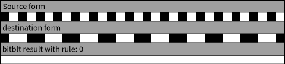

and with half Tone

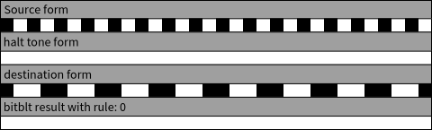

#### "0001 - 1: source is 1 and destination is 1 - logical AND" 

without half Tone 

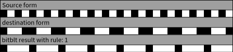

and with half Tone


#### "0010 - 2: source is 1 and destination is 0"

without half Tone 

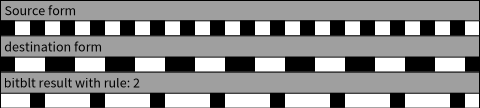

and with half Tone


#### "0011 - 3: source is 1 and dest is 0 or 1"

without half Tone 

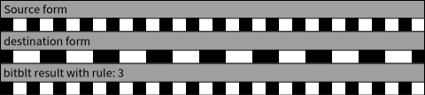

and with half Tone


#### "0100 - 4: source is 0 and destination is 1"

without half Tone 

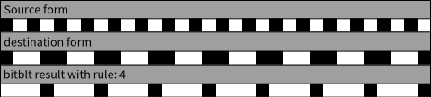

and with half Tone


#### "0101 - 5: source is 0 or 1 and destination is 1"

without half Tone 

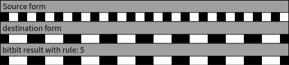

and with half Tone


#### "0110 - 6: source is 0 and destination is 1, or 

without half Tone 

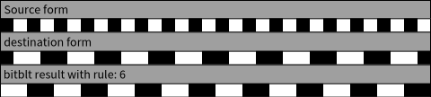

and with half Tone

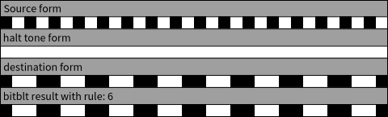

#### "0111 - 7: source is 1, and destination is 0 or is 1"

without half Tone 

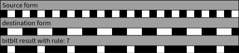

and with half Tone

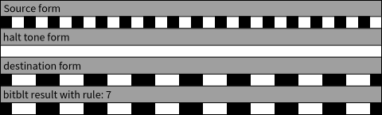

#### 1000 - 8: source is 0 and destination is 0"

without half Tone 

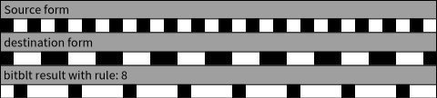

and with half Tone

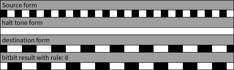

#### "1001 - 9: source is 0 and destination is 0 or 

without half Tone 

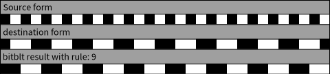

and with half Tone


#### "1010 - 10: source is 0 and destination is 0, or 

without half Tone 

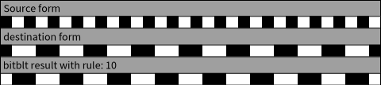

and with half Tone


#### "1011 - 11: source is 0 and destination is 0, or her 0 or 1"

without half Tone 

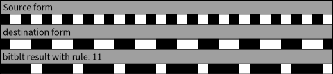

and with half Tone


#### "1100 - 12: source is 0 and destination is 0 or 1"

without half Tone 

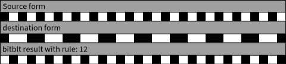

and with half Tone

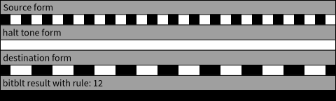

#### "1101 - 13: source is 0 and destination is 0 or is 1"

without half Tone 

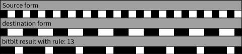

and with half Tone


#### "1110 - 14: source is 0 and destination is 0 or is 0"

without half Tone 

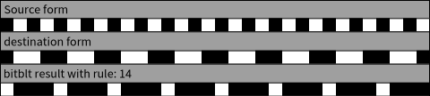

and with half Tone


#### "1111 - 15: source is 0 or 1, and destination is 0 or 1 -> always return destination color".

without half Tone 

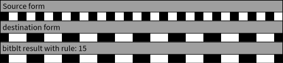

and with half Tone


### after 15

In addition to the original 16 combination rules, this BitBlt supports those rules.
Those example are provided without mask, and a selection of color. It may be not
representative of real-world image. 

The form used here are:

```smalltalk
	sourceForm := ((Form extent: 6 @ 1 depth: 32) initFromArray: #( 16rffff0000 "red" 16rff0000ff "blue" 16rff00ff00 "green" 16rff000000 "black" 16rffffffff "white" 16rffffff00 "yellow")) magnifyBy: 15.

	initDestForm := ((Form extent: 6 @ 1 depth: 32) initFromArray: #( 16rffffff00 16rffffff00 16rffffff00 16rffffff00 16rffffff00 16rffffff00 )) magnifyBy: 15.
    
	destForm := ((Form extent: 6 @ 1 depth: 32) initFromArray: #( 16rffffff00 16rffffff00 16rffffff00 16rffffff00 16rffffff00 16rffffff00 )) magnifyBy: 15.
```

- 16 - fails (to simulate paint bits)
- 17 - fails (to simulate erase bits)
- 18 - sourceWord + destinationWord
  
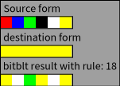

- 19 - sourceWord - destinationWord

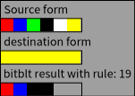

- 20 - rgbAdd: sourceWord with: destinationWord.  Sum of color components

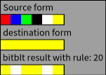

- 21 - rgbSub: sourceWord with: destinationWord.  Difference of color components


- 22 - OLDrgbDiff: sourceWord with: destinationWord.  Sum of abs of differences in components

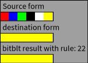

- 23 - OLDtallyIntoMap: destinationWord.  Tallies pixValues into a colorMap
these old versions don't do bitwise dest clipping.  Use 32 and 33 now.

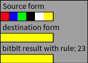

- 24 - alphaBlend: sourceWord with: destinationWord.  32-bit source and dest only


- 25 - pixPaint: sourceWord with: destinationWord.  Wherever the sourceForm is non-zero, it replaces the destination.  Can be used with a 1-bit source color mapped to (0, FFFFFFFF), and a fillColor to fill the dest with that color wherever the source is 1.


- 26 - pixMask: sourceWord with: destinationWord.  Like pixPaint, but fills with 0.


- 27 - rgbMax: sourceWord with: destinationWord.  Max of each color component.


- 28 - rgbMin: sourceWord with: destinationWord.  Min of each color component.

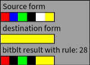

- 29 - rgbMin: sourceWord bitInvert32 with: destinationWord.  Min with (max-source)

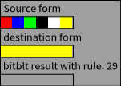

- 30 - alphaBlendConst: sourceWord with: destinationWord.  alpha is an arg. works in 16 bits.


- 31 - alphaPaintConst: sourceWord with: destinationWord.  alpha is an arg. works in 16 bits.


- 32 - rgbDiff: sourceWord with: destinationWord.  Sum of abs of differences in components


- 33 - tallyIntoMap: destinationWord.  Tallies pixValues into a colorMap


- 34 - alphaBlendScaled: srcWord with: dstWord. Alpha blend of scaled srcWord and destWord.

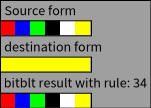

- 37 (CRrgbMul -  Multiply RGB or RGBA components of the pixel)


- 40 (fixAlpha:with: - CRfixAlpha - For any non-zero pixel value in destinationWord with zero alpha channel take the alpha from sourceWord and fill it in. Intended for fixing alpha 	channels left at zero during 16->32 bpp conversions.)


- 41 (CR_rgbComponentAlpha componentAlphaModeColor is the color, sourceWord contains an alpha value for each component of RGB, each of which is encoded as0 meaning 0.0 and 255 meaning 1.0 . the rule is...

TODO - understand rule 41

- 
### Sources

Smalltalk 80 blue book - p332 and later.

- https://en.wikipedia.org/wiki/Blitter
- https://fmfi-uk.hq.sk/Informatika/Smalltalk/Online%20Book/english/sqk/sqk00078.htm
- https://fmfi-uk.hq.sk/Informatika/Smalltalk/Online%20Book/english/sqk/sqk00066.htm
- https://fmfi-uk.hq.sk/Informatika/Smalltalk/Online%20Book/english/sqk/sqk00069.htm
