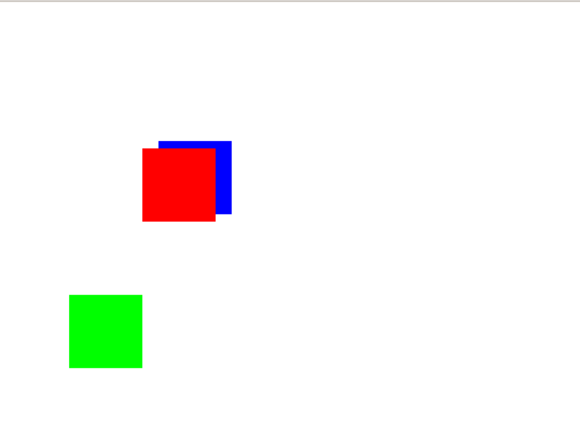

## Bloc

Bloc introduction to be written

This chapter is heavily inspired by [morphic introduction](https://github.com/SquareBracketAssociates/NewPharoByExample9/blob/master/Chapters/Morphic/Morphic.pillar).

### BlElement

All of the objects that you see on the screen when you run Pharo are
`BlElemment`s, that is, they are instances of subclasses of class `BlElement`.

The class `BlElement` itself is a large class with many methods; this makes it
possible for subclasses to implement interesting behavior with little code. You
can also customize an element directly. Contrary to the old Morphic environment,
Bloc favors much more object composition over inheritance.

To create a BlElement to represent a string object, execute the following code in a Playground.

```smalltalk
BlTextElement new text: 'Hello world!' asRopedText openInNewSpace.
```

This creates a BlTextElement to represent the string
*'Hello World!'*, and then opens it (that is, displays it) in the
*space*, which is the name that Pharo gives to the screen.
You should obtain a graphical element (a `BlElement`), which you can
inspect.

Of course, it is possible to define elements that are more interesting
graphical representations than the one that you have just seen.

Now execute in a Playground:

```
BlElement new size: 20@20; background: (BlBackground paint: Color orange)
```

Instead of the string-like element, you get an orange square.


### Manipulating BlElement

Bloc elements are objects, so we can manipulate them like any other
object in Pharo: by sending messages, we can change their
properties, create new subclasses of Morph, and so on.

Every bloc element, when opened on the screen has a position and a
size. If they are irregularly shaped, their position and size are
those its *bounds*.

- The `position` method returns a `Point` that describes the location of the bloc element upper-left corner of its bounding box. The origin of the coordinate system is the parent's upper left corner, with *y* coordinates increasing *down* the screen and *x* coordinates increasing to the right.
- The `extent` method also returns a point, but this point specifies the width and height of the bloc element rather than a location.

Type the following code into a playground and **Do it**:

```smalltalk
joe := BlElement new size: 100@50; background: Color blue.
bill := BlElement new size: 100@50; background: Color red; position: 100@100.
space := BlSpace new.
space root addChildren: { joe . bill }.
space show .
```

Then, in the inspector, type `self position` and then `Print it`. To move joe,
execute `joe position: (self position + (10@3))` repeatedly.

It is possible to do a similar thing with size. `self extent` answers joe's
size; to have joe grow, execute `self size: (self extent * 1.1)`. To change
the color of a morph, send it the `color:` message with the desired `Color`
object as argument, for instance, `self background: (BlBackground paint: Color orange)`.
To add transparency, try `self background: (BlBackground paint: (Color orange alpha: 0.2))`.

### Composing bloc elements

One way of creating new graphical representations is by placing one
bloc element inside another. This is called *composition*; Bloc elements can be
composed to any depth. You can place a morph inside another by sending the
message `addChild:` to the container morph. This is what happens when you send
the message `openInNewSpace`. Your element is added to the *space* element.

Try adding an element to another one as follows:

```smalltalk
| joe balloon |
joe := BlElement new size: 100@100; background: (BlBackground paint: (Color orange alpha: 0.2)).
balloon := BlElement new 
            geometry: (BlCircleGeometry new matchExtent: 100 @ 50);
            size: 100 @ 100;
            background: (BlBackground paint: Color yellow).
joe addChild: balloon.
joe openInNewSpace.
joe.
```

The balloon is added inside joe following default layout rules. More on that later.


### Creating your own bloc element

BlElement offers you various methods to customize their appearance. As an example,
Let's use this knowledge to create a cross-shaped bloc element.

```smalltalk
| cross w h |
w := 200.
h := 200.
cross := BlElement new 
	size:w@h ;
	background: (BlBackground paint: (Color blue alpha: 0.2));
	border: (BlBorder paint: Color black width: 2);
	geometry: (BlPolygonGeometry vertices: {
                        (w/3 @ 0).
                        (w/3*2 @ 0).
                        (w/3*2 @ (h/3)).
                        (w @ (h/3)).
                        (w @ (h/3*2)) .
                        (w/3*2 @ (h/3*2)) .
                        (w/3*2 @ h) .
                        (w/3 @ h).
                        (w/3 @ (h/3*2)) .
                        (0 @ (h/3*2)) .
                        (0 @ (h/3)) .
                        (w/3 @ (h/3))}
                        ).
```


`BlElement` bounding box is automatically defined by its geometry. Now, let's add
some mouse interaction.

### Mouse events for interaction

To build live user interfaces using bloc elements, we need to be able to
interact with them using the mouse and keyboard. 
Moreover, the element needs to be able to respond to user input by changing their appearance and position -- that is, by animating themselves.

Let's extend our cross element to handle mouse events. Suppose that when we
enter on the cross, we want to change the color of the cross to red, and when
we leave it, we want to change the color to yellow.

```smalltalk
cross addEventHandler: (BlEventHandler
                on: BlMouseEnterEvent
                do: [ :anEvent | cross background: (Color red alpha: 0.2) ]).

cross addEventHandler: (BlEventHandler
                on: BlMouseLeaveEvent 
                do: [ :anEvent | cross background: (Color yellow alpha: 0.2) ]).
```

The `BlMouseEnterEvent` and `BlMouseLeaveEvent` are an instance of
**BlMouseEvent**, which is a subclass of `BlEvent`.
Browse those classes to see what other objects are available for the mouse events.

### Keyboard events

To catch keyboard events, we need to ask our object to manage those events as
well.

With a single key combination:

```smalltalk
cross addShortcut: (BlShortcutWithAction new
      combination: (BlSingleKeyCombination key: KeyboardKey right);
      action: [ :anEvent :aShortcut | cross position: (cross position + (10@10)) ]).
```

with multiple key combination (builder being an instance of *BlKeyCombinationBuilder*)

```smalltalk
cross addShortcut: (BlShortcutWithAction new
      combination: (BlKeyCombination builder control l build);
      action: [ :anEvent :aShortcut | cross position: (cross position + (10@10))]).
```

To move your cross among the 4 directions:

```smalltalk
cross addShortcut: (BlShortcutWithAction new
      combination: (BlSingleKeyCombination key: KeyboardKey up);
      action: [ :anEvent :aShortcut | cross position: (cross position - (0@10))]).

cross addShortcut: (BlShortcutWithAction new
      combination: (BlSingleKeyCombination key: KeyboardKey right);
      action: [ :anEvent :aShortcut | cross position: (cross position + (10@0))]).

cross addShortcut: (BlShortcutWithAction new
      combination: (BlSingleKeyCombination key: KeyboardKey left);
      action: [ :anEvent :aShortcut | cross position: (cross position - (10@0))]).

cross addShortcut: (BlShortcutWithAction new
      combination: (BlSingleKeyCombination key: KeyboardKey down);
      action: [ :anEvent :aShortcut | cross position: (cross position + (0@10))]).
```

We have written this method so that you can move the morph using the arrow keys.
To discover the key values, you can open and add this method to your element.

```smalltalk
cross addEventHandler: (BlEventHandler
        on: BlKeyDownEvent
        do: [ :anEvent | self inform: 'Key down: ' , anEvent key asString ]).
```

To ensure your cross has the focus, send the message
`cross requestFocus.`

### Bloc animations

Bloc provides the base of an animation system with `BlAnimation` class. You
can create your own animation by subclassing and customizing this class. Here,
we'll use pre-defined animation by using `BlNumberTransition`, which allows us
to create animation by defining specific values within a number range and specific
time interval.

Make your cross blink by defining this method as follows:

```smalltalk
animation := (BlNumberTransition new
        from: 0;
        to: 1;
        by: 0.5;
        beInfinite;
        duration: 3 seconds;
        onStepDo: [ :aValue :anElement |
            aValue < 0.5
                ifTrue: [ anElement background: Color red ]
                ifFalse: [ anElement background: Color blue ] ]).

cross addAnimation: animation.
```

The animation will start immediately once added to your element.

Alternatively, you can handle *key stroke* so that you can
use the *s* and *e* keys to start and end stepping.

```smalltalk
cross addShortcut: (BlShortcutWithAction new
      combination: (BlSingleKeyCombination key: KeyboardKey S);
      action: [ :anEvent :aShortcut | animation start]).

cross addShortcut: (BlShortcutWithAction new
      combination: (BlSingleKeyCombination key: KeyboardKey E);
      action: [ :anEvent :aShortcut | animation stop]).
```

Here is the full source for the cross. Please note that we don't need to subclass
`BlElement` to create a custom element.
You mainly need to customize your element properties to fit your need

```smalltalk
| cross w h animation |

w := 200.
h := 200.
cross := BlElement new
size:w@h ;
background: (BlBackground paint: (Color blue alpha: 0.2));
border: (BlBorder paint: Color black width: 2);
geometry: (BlPolygonGeometry vertices: {
                            (w/3 @ 0).
                            (w/3*2 @ 0).
                            (w/3*2 @ (h/3)).
                            (w @ (h/3)).
                            (w @ (h/3*2)) .
                            (w/3*2 @ (h/3*2)) .
                            (w/3*2 @ h) .
                            (w/3 @ h).
                            (w/3 @ (h/3*2)) .
                            (0 @ (h/3*2)) .
                            (0 @ (h/3)) .
                            (w/3 @ (h/3))});
position: 30@30.
cross addEventHandler: (BlEventHandler
                on: BlMouseEnterEvent
                do: [ :anEvent |
                    cross background: (Color red alpha: 0.2) ]).

cross addEventHandler: (BlEventHandler
                on: BlMouseLeaveEvent 
                do: [ :anEvent |
                    cross background: (Color yellow alpha: 0.2) ]).

cross addShortcut: (BlShortcutWithAction new
      combination: (BlSingleKeyCombination key: KeyboardKey up);
      action: [ :anEvent :aShortcut | cross position: (cross position - (0@10))]).

cross addShortcut: (BlShortcutWithAction new
      combination: (BlSingleKeyCombination key: KeyboardKey right);
      action: [ :anEvent :aShortcut | cross position: (cross position + (10@0))]).

cross addShortcut: (BlShortcutWithAction new
      combination: (BlSingleKeyCombination key: KeyboardKey left);
      action: [ :anEvent :aShortcut | cross position: (cross position - (10@0))]).

cross addShortcut: (BlShortcutWithAction new
      combination: (BlSingleKeyCombination key: KeyboardKey down);
      action: [ :anEvent :aShortcut | cross position: (cross position + (0@10))]).

animation := (BlNumberTransition new
        from: 0;
        to: 1;
        by: 0.5;
        beInfinite;
        duration: 3 seconds;
        onStepDo: [ :aValue :anElement |
            aValue < 0.5
                ifTrue: [ anElement background: Color red ]
                ifFalse: [ anElement background: Color blue ] ]).

cross addAnimation: animation.

cross addShortcut: (BlShortcutWithAction new
      combination: (BlSingleKeyCombination key: KeyboardKey S);
      action: [ :anEvent :aShortcut | animation start]).

cross addShortcut: (BlShortcutWithAction new
      combination: (BlSingleKeyCombination key: KeyboardKey E);
      action: [ :anEvent :aShortcut | animation stop]).

cross openInNewSpace.
cross requestFocus.
```

### Drag-and-drop

Bloc has also basic support for drag-and-drop which needs to be further
improved. In the coming example, if you change the order of appearance of the
elements, drag&drop may not work - element will not catch the appropriate event.
This example will however show all events used with a working example.

Let's examine a simple example with three bloc elements, a target, and two sources.
The target will accept an element only if the dropped one matches a given
condition: in our example, the element background should be blue.
If it is rejected, it'll be moved to a specified location.

Let's define those 3 elements:

```smalltalk
source := BlElement new
                background: Color blue;
                size: 100 @ 100;
                position: 10 @ 10.

target := BlElement new
                zIndex: 1000; "to put it in front of the others."
                    background: Color red;
                size: 100 @ 100;
                position: 200 @ 200.

reject := BlElement new
                background: Color green;
                size: 100 @ 100;
                position: 100 @ 200.
```

Let's also define the necessary drag event, to be able to move the blue and the
green elements.

```smalltalk
source addEventHandlerOn: BlDragStartEvent do: [ :event |
    event consumed: true.
    offset := event position - source position ].

source addEventHandlerOn: BlDragEvent
    do: [ :event | source position: event position - offset ].

reject addEventHandlerOn: BlDragStartEvent do: [ :event |
    event consumed: true.
    offset := event position - reject position ].

reject addEventHandlerOn: BlDragEvent
    do: [ :event | reject position: event position - offset ].
```  

How do we decide if the target element will accept or reject the dropped one?
The receiver does this by checking *gestureSource* from the drop event received .

What happens to the dropped element if the target doesn't want it?
The default behavior is for it to do nothing, that is, to sit below the target,
but without interacting with it. A more intuitive behavior is for the dropped
element to be placed at a specified location.

```smalltalk
target addEventHandlerOn: BlDropEvent do: [ :event |
    event consumed: true.
    event gestureSource background paint color = Color blue
        ifTrue: [ self inform: 'drop accepted' ]
        ifFalse: [
            self inform: 'drop rejected'.
            event gestureSource position: 100 @ 400 ] ].
```

The green morph is rejected and goes to a specific location.



The full source for drap&drop example:

```smalltalk
| space source target reject offset |
space := BlSpace new.

source := BlElement new
                background: Color blue;
                size: 100 @ 100;
                position: 10 @ 10.

target := BlElement new
                zIndex: 1000; "to put it in front of the others."
                    background: Color red;
                size: 100 @ 100;
                position: 200 @ 200.

reject := BlElement new
                background: Color green;
                size: 100 @ 100;
                position: 100 @ 200.

source addEventHandlerOn: BlDragStartEvent do: [ :event |
    event consumed: true.
    offset := event position - source position ].
source
    addEventHandlerOn: BlDragEvent
    do: [ :event | source position: event position - offset ].

reject addEventHandlerOn: BlDragStartEvent do: [ :event |
    event consumed: true.
    offset := event position - reject position ].

reject
    addEventHandlerOn: BlDragEvent
    do: [ :event | reject position: event position - offset ].

target addEventHandlerOn: BlDropEvent do: [ :event |
    event consumed: true.
    event gestureSource background paint color = Color blue
        ifTrue: [ self inform: 'drop accepted' ]
        ifFalse: [
            self inform: 'drop rejected'.
            event gestureSource position: 100 @ 400 ] ].

"note: order is important. Otherwise, use zIndex"
space root addChildren: {
        target.
        source.
        reject }.

space show.
^ space
```

### A complete example (TBD)

Let's design a bloc element to roll a die.
Clicking on it will display the values of all sides of the die in a quick loop,
and another click will stop the animation.


%

%|caption=Defining the die morph|label=scr:classDie
```language=smalltalk
BlElement << #BlDie
	slots: { #faces . #dieValue . #animation };
	tag: 'Bloc';
	package: 'BookletGraphics'
```

The instance variable `faces` records the number of faces on the die; we allow dice with up to 9 faces! `dieValue` records the value of the face that is currently displayed, and `isStopped` is true if the die animation has stopped running. 
To create a die instance, we define the `faces: n` method on the ''class'' side of `BlDie` to create a new die with `n` faces.

%|caption=Creating a new die with the number of faces we 
like|label=scr:facesClass

```language=smalltalk
DieMorph class >> faces: aNumber
	^ self new faces: aNumber
```

The `initialize` method is defined on the instance side in the usual way;
remember that `new` automatically sends `initialize` to the newly-created instance.

%|caption=Initializing instances of `DieMorph`|label=scr:initializeDie
```language=smalltalk
DieMorph >> initialize

	super initialize.

	dieValue := 1.
	faces := 6.

	self
		size: 150 @ 150;
		position: 100@100;
		geometry: (BlRoundedRectangleGeometry cornerRadius: 10);
		border: (BlBorder paint: Color black width: 2);
		background: ((BlLinearGradientPaint direction: 1 @ 1)
				 from: Color green
				 to: Color lightGreen).

    self whenLayoutedDoOnce:  [ self drawPoints].
```

We use a few properties of `BlElement` to give a nice 
appearance to the die: a thick border with a raised 
effect, rounded corners, and a color gradient on
the visible face. We define the instance method 
`faces:` to check for a valid parameter as follows:

%|caption=Setting the number of faces of the die|label=scr:numberOfFaces

```language=smalltalk
DieMorph >> faces: aNumber
	"Set the number of faces"

	((aNumber isInteger and: [ aNumber > 0 ]) and: [ aNumber <= 9 ])
		ifTrue: [ faces := aNumber ]
```

It may be good to review the order in which the messages are sent when a die is
created. 
For instance, if we start by evaluating `DieMorph faces: 9`:

- The class method `DieMorph class >> faces:` sends `new` to `DieMorph class`.
- The method for `new` (inherited by `DieMorph class` from `Behavior`) creates the new instance and sends it the `initialize` message.
- The `initialize` method in `DieMorph` sets `faces` to an initial value of 6.
- `DieMorph class >> new` returns to the class method `DieMorph class >> faces:`, which then sends the message `faces: 9` to the new instance.
- The instance method `DieMorph >> faces:` now executes, setting the `faces` instance variable to 9.

Before defining how to draw our die, we need a few methods
to place the dots on the displayed face:

%|caption=Nine methods for placing points on the faces of the die|label=scr:placeDots

```language=smalltalk
DieMorph >> face1
	^ {(0.5 @ 0.5)}
```

```language=smalltalk
DieMorph >> face2
	^{0.25@0.25 . 0.75@0.75}
```

```language=smalltalk
DieMorph >> face3
	^{0.25@0.25 . 0.75@0.75 . 0.5@0.5}
```

```language=smalltalk
DieMorph >> face4
	^{0.25@0.25 . 0.75@0.25 . 0.75@0.75 . 0.25@0.75}
```

```language=smalltalk
DieMorph >> face5
	^{0.25@0.25 . 0.75@0.25 . 0.75@0.75 . 0.25@0.75 . 0.5@0.5}
```

```language=smalltalk
DieMorph >> face6
	^{0.25@0.25 . 0.75@0.25 . 0.75@0.75 . 0.25@0.75 . 0.25@0.5 . 0.75@0.5}
```

```language=smalltalk
DieMorph >> face7
	^{0.25@0.25 . 0.75@0.25 . 0.75@0.75 . 0.25@0.75 . 0.25@0.5 . 0.75@0.5 . 0.5@0.5}
```

```language=smalltalk
DieMorph >> face8
	^{0.25@0.25 . 0.75@0.25 . 0.75@0.75 . 0.25@0.75 . 0.25@0.5 . 0.75@0.5 . 0.5@0.5 . 0.5@0.25}
```

```language=smalltalk
DieMorph >> face9
	^{0.25@0.25 . 0.75@0.25 . 0.75@0.75 . 0.25@0.75 . 0.25@0.5 . 0.75@0.5 . 0.5@0.5 . 0.5@0.25 . 0.5@0.75}
```

These methods define collections of the coordinates of 
dots for each face.
The coordinates are in a square of size 1x1; we will
simply need to scale them to place the actual dots.

The `drawPoints` method draws the dots
as follows:

%|caption=Drawing the die morph|label=scr:drawOnDie
```language=smalltalk
DieMorph >> drawPoints

	(self perform: ('face' , dieValue asString) asSymbol) do: [ :aPoint |
		self drawPointAt: aPoint ]
```

This method uses the reflective capacities of Pharo.
Drawing the dots of a face is a simple matter of iterating
over the collection given by the `faceX` method for that
face, sending the ` drawPointAt:` message for each
coordinate. 

To call the correct `faceX` method, we use the `perform:`
method which sends a message built from a string, `('face',
dieValue asString) asSymbol`. 

%|caption=Drawing a single dot on a face|label=scr:drawDotOn
```language=smalltalk
DieMorph >> drawPointAt: aPoint

	| element  x y|
	x := self extent / 6.
	y := self extent  / 6.

	element := BlElement new
		           geometry: BlCircleGeometry new;
		           size: x @ y ;
		           background: Color black;
		           position: (self extent * aPoint) - ((x/2)@(y/2)).
	self addChild: element.
```


```language=smalltalk|caption=Create a Die 6|label=scr:die6
(BlDie faces: 6) openInNewSpace.
```

%


To change the displayed face, we create an accessor that 
we can use as `myDie dieValue: 5`:

%|caption=Setting the current value of the die|label=scr:dieValue
```language=smalltalk
DieMorph >> dieValue: aNumber

	((aNumber isInteger and: [ aNumber > 0 ]) and: [ aNumber <= faces ])
		ifFalse: [ ^ self ].
	dieValue := aNumber.
	self removeChildren.
	self drawPoints
```

%


Now we will use the animation system to show quickly all
the face. Add this in the `initialize` method.

%|caption=Animating the die|label=scr:stepDie

```language=smalltalk
BlDie >> initialize
	animation := BlAnimation new
		             beInfinite;
		             duration: 1 seconds.

	animation addEventHandler: (BlEventHandler
			 on: BlAnimationLoopDoneEvent
			 do: [ :anEvent | self inform: 'loop done'. self dieValue: (1 to: faces) atRandom ]).

    self addAnimation: animation
```

Now the die is rolling!

To start or stop the animation by clicking, we will use 
what we learned previously about mouse events. 
Add this code as well in the `initialize` method.

% |caption=Handling mouse clicks to start and stop the animation|label=scr:handleMouseDie
```language=smalltalk
BlDie >> initialize

self addEventHandler: (BlEventHandler
			 on: BlClickEvent 
			 do: [ :anEvent |
				 animation isRunning
					 ifTrue: [
						self inform: 'stop'.
						 animation stop. ]
					 ifFalse: [
						self inform: 'start'.
						animation reset; start; setNew; enqueue ] ]).

```

Now the die will roll or stop rolling when we click on it.