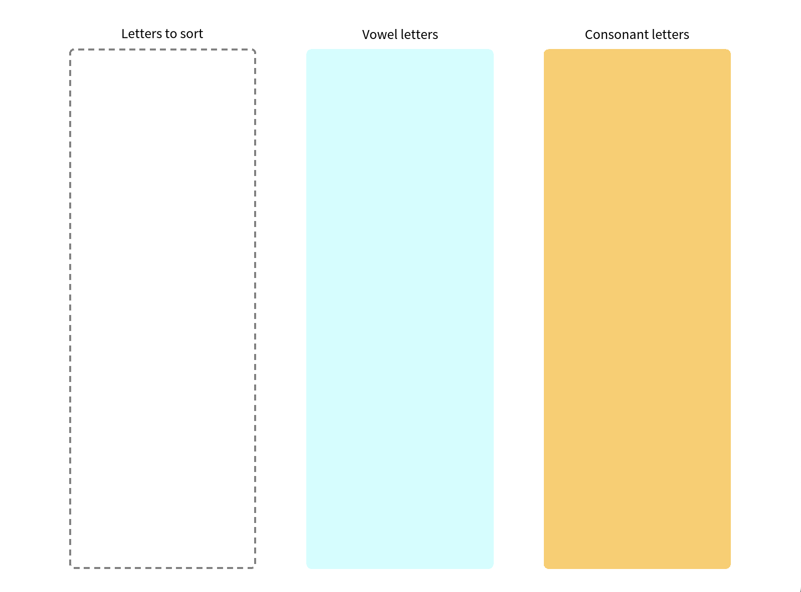
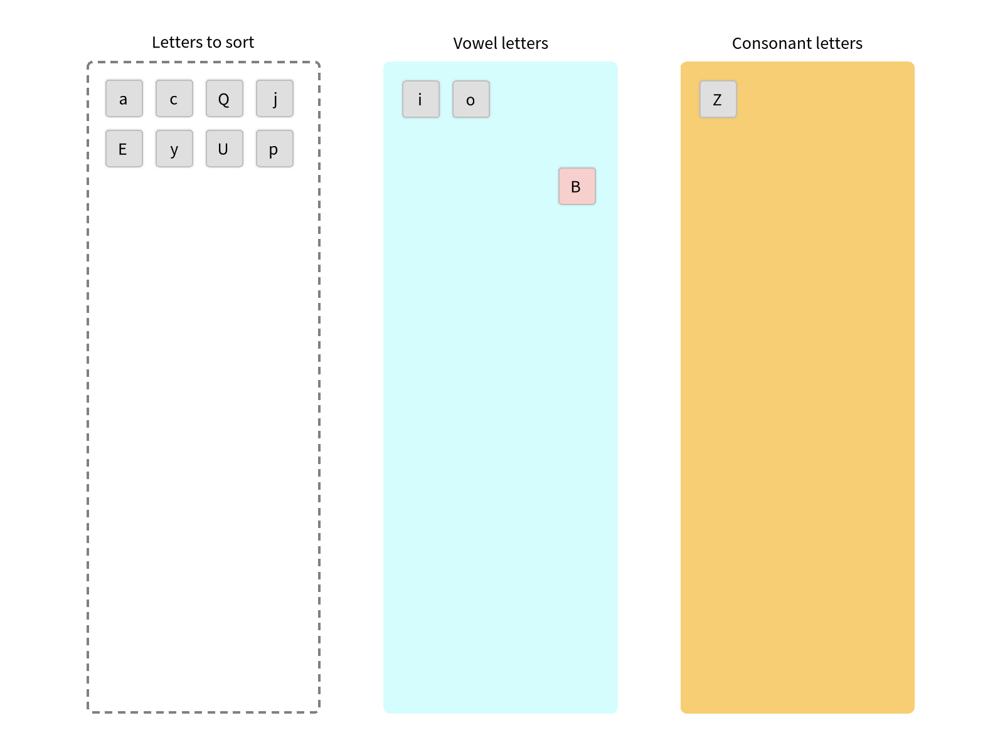

# Letters Sorter Drag Example

Let's create a complete example of a Letters Sorter where you drag letters elements and drop them on the right containers depending if the letter is a consonant or a vowel.

We can start by creating a class for our main element, it will inherit from BlElement :

```st
BlElement << #BlDragSortLettersExample
	slots: {};
	tag: '';
	package: 'LetterSorter'
```

we can then define its initialization method with constraints to take the whole space and a linear layout that will help us position our letters containers.

```st
initialize

	super initialize.
	self constraintsDo: [ :c |
		c vertical matchParent.
		c horizontal matchParent ].
	self layout: (BlLinearLayout horizontal cellSpacing: 50).
	self padding: (BlInsets all: 20).

    self initializeContainers.
	self initializeLetters 
```

We can the add the two methods to initialize the containers and the letters with it.

## Containers

We define 3 containers :
- the Letters container, where all letters will be at the initialization
- the Vowels container, where we can sort the vowels
- the Consonants container, where we can sort the consonants

```st
initializeContainers 

	self initializeLettersContainer.
	self initializeVowelsContainer.
	self initializeConsonantsContainer.
``` 

Here is how we define the first container for the letters, that we define as an instance variable of BlDragSortLettersExample :

```st
initializeLettersContainer

	lettersContainer := BlDragLetterContainer new border:
		                    (BlBorderBuilder new
			                     paint: Color gray;
			                     dashed;
			                     width: 2;
			                     build).
```

You can see that we use a class named BlDragLetterContainer that we will define right now.

### Classic container

```st
BlElement << #BlDragLetterContainer
	slots: { #dropAcceptBehavior . #dropRejectBehavior . #dragEnterAcceptBehavior . #dragEnterRejectBehavior . #dragLeaveBehavior . #dropAcceptCondition };
	tag: '';
	package: 'LetterSorter'
```
For this example we want to express specific behaviors to containers for when an element is dragged above it or dropped in it.

In this class we define instance variables for block closures that will hold our different behaviors.

These behaviors are as listed : What happens when an element is...
- dropped and accepted ?
- dropped and rejected ?
- entering and accepted ?
- entering and rejected ?
- leaving ?

And these all depend on what we call the `dropAcceptCondition` which we can define to tell if a an element is accepted or not in a container.

For now, let's focus on initializing a container :

```st
BlDragLetterContainer>>initialize

	super initialize.
	self
		layout: BlFlowLayout horizontal;
		constraintsDo: [ :c |
			c horizontal matchParent.
			c vertical matchParent ];
		padding: (BlInsets all: 10);
		geometry: (BlRoundedRectangleGeometry cornerRadius: 5).
```

as a BlElement, we give it a FlowLayout to display the letters depending on their sizes.
We can then initialize the `dropAcceptCondition` (returning True by default) and the default behaviors as well as the eventHandlers to react and use defined behaviors.

```st
BlDragLetterContainer>>initialize

	super initialize.
	self
		layout: BlFlowLayout horizontal;
		constraintsDo: [ :c |
			c horizontal matchParent.
			c vertical matchParent ];
		padding: (BlInsets all: 10);
		geometry: (BlRoundedRectangleGeometry cornerRadius: 5).

	dropAcceptCondition := [:e | true ].
	self initializeDefaultBehaviours.
	self initializeDropEvent.
	self initializeDragEnterEvent.
	self initializeDragLeaveEvent 
```

```st
initializeDefaultBehaviours 

	dropAcceptBehavior := [:e | ].
	dropRejectBehavior := [:e | ].
	dragEnterAcceptBehavior := [:e | ].
	dragEnterRejectBehavior := [:e | ].
	dragLeaveBehavior := [:e | ]
```

```st
initializeDropEvent

	self addEventHandlerOn: BlDropEvent do: [ :event |
			| element |
			event consume.
			element := event gestureSource.
			(self dropAcceptCondition value: element)
				ifTrue: [
						self dropAcceptBehavior value: element.]
				ifFalse: [
						self dropRejectBehavior value: element.]]
```

```st
initializeDragEnterEvent

	self addEventHandlerOn: BlDragEnterEvent do: [ :event |
			| element |
			event consumed: true.
			element := event gestureSource.
			(self dropAcceptCondition value: element)
				ifTrue: [ self dragEnterAcceptBehavior value: element ]
				ifFalse: [ self dragEnterRejectBehavior value: element ] ]
```

```st
initializeDragLeaveEvent

	self addEventHandlerOn: BlDragLeaveEvent do: [ :event |
			| element |
			event consume.
			element := event gestureSource.
			self dragLeaveBehavior value: element ]
```

We see that during drag and drop events, we follow a certain behavior depending on the dropAcceptCondition.

### Vowels and Consonants

Now that we defined the basic implementation of our containers, we can express the specific behaviors for each vowel and consonant container.

```st
initializeLettersContainer

	lettersContainer := BlDragLetterContainer new border:
		                    (BlBorderBuilder new
			                     paint: Color gray;
			                     dashed;
			                     width: 2;
			                     build).
	lettersContainer dropAcceptBehavior: [ :element |
			element removeFromParent.
			lettersContainer addChild: element ].
```

Here for the letters container we simply accept any letter and add them to this container when dropped.

```st
initializeVowelsContainer

	vowelsContainer := BlDragLetterContainer new background:
		                   Color lightBlue.

	vowelsContainer dropAcceptCondition: [ :element | element isVowel ].
	vowelsContainer dropAcceptBehavior: [ :element |
			element removeFromParent.
			vowelsContainer addChild: element ].
	vowelsContainer dropRejectBehavior: [ :element |
			element
				removeFromParent;
				allowMeAndChildrenMouseEvents.
			element defaultContainer addChild: element ].

	vowelsContainer dragEnterAcceptBehavior: [ :element |
		element background: Color lightGreen ].
	vowelsContainer dragEnterRejectBehavior: [ :element |
		element background: Color lightRed ].
	vowelsContainer dragLeaveBehavior: [ :element |
		element background: Color veryVeryLightGray ]
```

For the Vowels container we define its dropAcceptCondition to accept vowel letters obviously, and add the letter to the container if it's the case, rejecting it and sending it back to its 'defaultContainer' (explained later in the Letters section) if not. Moreover, we change the letter's color to green or red when entering the container depending on the dropAcceptCondition. 

```st
initializeConsonantsContainer

	consonantsContainer := BlDragLetterContainer new background:
		                       Color lightOrange.

	consonantsContainer dropAcceptCondition: [ :element |
		element isVowel not ].
	consonantsContainer dropAcceptBehavior: [ :element |
			element removeFromParent.
			consonantsContainer addChild: element ].
	consonantsContainer dropRejectBehavior: [ :element |
			element removeFromParent.
			element defaultContainer addChild: element ].

	consonantsContainer dragEnterAcceptBehavior: [ :element |
		element background: Color lightGreen ].
	consonantsContainer dragEnterRejectBehavior: [ :element |
		element background: Color lightRed ].
	consonantsContainer dragLeaveBehavior: [ :element |
		element background: Color veryVeryLightGray ]
```

Similar to the vowels container, the consonant container add a letter to its children if it's a consonant and sends it back to its defaultContainer if not.

Now that our containers are defined, let's display them before adding letters.

Here we define a small method to help us display the containers with a bit of text above it :

```st
labelContainer: anElement with: aText

	^ BlElement new
		  layout: (BlLinearLayout vertical alignTopCenter cellSpacing: 10);
		  constraintsDo: [ :c |
				  c horizontal matchParent.
				  c vertical matchParent ];
		  addChild: (BlTextElement new text: aText asRopedText);
		  addChild: anElement
```

this method can be used in the `initializeContainers` method

```st
initializeContainers

	self initializeRootContainer.
	self initializeLettersContainer.
	self initializeVowelsContainer.
	self initializeConsonantsContainer.

	self addChild:
		(self labelContainer: lettersContainer with: 'Letters to sort').
	self addChild:
		(self labelContainer: vowelsContainer with: 'Vowel letters').
	self addChild:
		(self labelContainer: consonantsContainer with: 'Consonant letters')
```

Don't forget to create the accessors for our instance variables !

Let's also define a `run` method to launch our example 

```st
run

	<script: 'self new openInSpace'>
```

Defining this method with the script pragma adds a small button next to the method's name in our browser.
If you hit this button, the code should run and give you this visual



## Letters

The containers are ready to welcome the letters so let's define those.

In the `BlDragSortLettersExample>>initialize` method we call `initializeLetters` that is defined as such:

```st
initializeLetters

	lettersContainer addChildren:
		({ $a. $c. $Q. $o. $j. $E. $y. $Z. $U. $B. $p. $i } collect: [ :each |
				 BlDragLetter new
					 character: each;
					 defaultContainer: lettersContainer ])
```

We take a bunch of random letters and create a `BlDragLetter` element for each assigning it the letter and the lettersContainer as its defaultContainer, i.e the container it will be sent if rejected.

The class `BlDragLetter` is defined like such :

```st
BlElement << #BlDragLetter
	slots: { #character . #defaultContainer };
	tag: '';
	package: 'LetterSorter'
```
It is a BlElement that will hold a TextElement with the character assigned as a Text.

```st
initialize

	super initialize.
	self
		layout: BlLinearLayout horizontal alignCenter;
		size: 30 @ 30;
		margin: (BlInsets all: 5);
		background: Color veryVeryLightGray;
		border: (BlBorder paint: Color veryLightGray width: 1);
		geometry: (BlRoundedRectangleGeometry cornerRadius: 3).
	self initializeEvents
```

We can initialize the events for this element to allow us to drag it 

```st
initializeEvents

	| space offset |
	self addEventHandlerOn: BlDragStartEvent do: [ :event |
			event consumed: true.
			space := self space.
			offset := self positionInSpace - event position.
			self removeFromParent.
			space root addChild: self.
			self preventMeAndChildrenMouseEvents ].

	self addEventHandlerOn: BlDragEndEvent do: [ :event |
			event consumed: true.
			self background: Color veryVeryLightGray.
			self allowMeAndChildrenMouseEvents ].

	self addEventHandlerOn: BlDragEvent do: [ :event |
			event consumed: true.
			self position: event position + offset ].
```

So when dragging the element we remove it from its parent and add it to the root while preventing it to further mouse events in order to deal with DragEnter and DragLeave events later. When dropping the element, we allow once again the mouse events otherwise we wouldn't be able to drag it again.

Then we can create the message `isVowel` that will return a boolean depending on the character of our Letter element.

```st
isVowel

	^ character isVowel
```

Finally, we create accessors for our instance variables `defaultContainer` and `character` with a small particularity on the character setter as we will create a TextElement with this character.

```st
character: aCharacter

	character := aCharacter.

	self addChild: (BlTextElement new
			 labelMeasurement;
			 text: aCharacter asString asRopedText)
```

## Testing our code

Everything is now ready to be executed, we can hit `run` to try our example.

You should see the letters in their container and you can drag them above the containers to see their background change depending on their characters.




You now have a good first application where you defined some drag and drop behaviours with containers accepting or rejecting an element depending on a specific condition.

## Going beyond this example

You might however come across the case where you drop a letter out of any container and the letter stays on the space root but we would like the letter to go back at least in a container even if dropped outside. 

To solve this we propose the following solution, we make our space root react to the DropEvent so that the dropped element is sent back to its default container. For this, we can simply add a message `initializeDropEvent` in the `BlDragSortLettersExample>>initialize` method and we define the drop behaviour as such : 

```st
initialize

	super initialize.
	self constraintsDo: [ :c |
			c vertical matchParent.
			c horizontal matchParent ].
	self layout: (BlLinearLayout horizontal cellSpacing: 50).
	self padding: (BlInsets all: 20).

	self initializeDropEvent.
	self initializeContainers.
	self initializeLetters
```

```st
initializeDropEvent

	self whenLayoutedDoOnce: [
			self parent addEventHandlerOn: BlDropEvent do: [ :e |
					| element |
					element := e gestureSource.
					e consume.
					element removeFromParent.
					element defaultContainer addChild: element ] ]
```