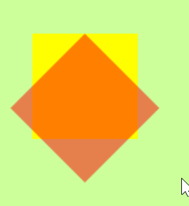

## Animations

### Introduction

An animation is a transformation of a **target** bloc element that can
be decomposed into multiple **steps**. The total of each steps
composes a **loop** which can be repeated N time or **beInfinite**.

Animation can be started with a certain **delay**, and last for a
specific **duration**. Execution **progress** is measured as a normalized 
number within [0..1] where:

- 0 means animation is not yet started.
- 1 animation loop is done

```text
        Step       Step      Step      Step      step    
|---------^---------^---------^---------^---------^---------|  -> animation loop
0....................progress...............................1 
```

When a step or the full loop is complete, animation
will raise `BlAnimationStepEvent` or `BlAnimationLoopDoneEvent`.

This simple animation will update the opacity of an element, indefinitely, 
every 5 seconds, with a delay of 5 seconds between each loop.

```smalltalk
|element animation|
element := BlElement new size: 150 @ 150; background: Color red.

animation := BlAnimation new beInfinite; delay: 5 seconds; duration: 5 seconds.

animation addEventHandler: (BlEventHandler
             on: BlAnimationLoopDoneEvent
		     do: [ :anEvent | element opacity: 0.0 .]).

animation addEventHandler: (BlEventHandler
             on: BlAnimationStepEvent
             do: [ :anEvent | element opacity: anEvent progress .]).

element addAnimation: animation; openInNewSpace.
```

This example is quite limited and don't allow for much customization. 
We'll see in the next section how you can define your own animation.

You can run multiple animations, in parallel or in sequence, which are 
managed by *BlSequentialAnimation* or *BlParallelAnimation*

Here is an example of using `BlSequentialAnimation`:

```smalltalk
| space element translation scale sequential |
translation := (BlTransformAnimation translate: 300 @ 300)
   easing: BlEasingElastic new ;
   duration: 2 seconds.

scale := (BlTransformAnimation scale: 2 @ 2)
easing: BlEasingElastic new;
duration: 2 seconds.

sequential := BlSequentialAnimation new addAll: {
  translation.
  scale }.

element := BlElement new
   background: Color blue;
   size: 100 @ 100;
   position: 100 @ 100.
element addAnimation: sequential.

space := BlSpace new.
space root addChild: element.
space show.
^space
```

**Important**
Animation is automatically started when added to an element.
Once stopped, an animation is considered as **complete**.

You can call **stop** to stop a running animation. 

You cannot add multiple time an animation to an element. If you need to reapply
one, you can restart it. To do so, you'll have to do this in a specific order,
as: `animation reset; start; setNew; enqueue`. Another solution is to add a *copy*
of your animation to your element. You can then add the same animation multiple
time. This is demonstrated below. In this example, we copy multiple time the 
same animation, and apply it to different targets

```smalltalk
animation := (BlTransformAnimation translate: 300 @ 0) duration: 3 seconds.

elt1 := BlElement new background: Color random.
elt2 := BlElement new background: Color random; position: 0 @ 100.
elt3 := BlElement new background: Color random; position: 0 @ 200.

container := BlElement new size: 600 asPoint.

container addChildren: { elt1. elt2. elt3 }.

space := BlSpace new.
space root addChild: container.
space show.

parallelTranslate := BlParallelAnimation withAll: ( container children collect: [ :e | 
|anim|
anim := animation copy.
anim target: e.
anim ] ).

blank := BlElement new.
space root addChild: blank.
blank addAnimation: parallelTranslate .
```

### Creating your own animation

The base *BlAnimation* give you the basic element for animation, and you can 
use it as a base to create more complex animation.

The entry point will be *BlAnimation >> doStep*, which is called at every step.
Let's look at its default implementation:

`self applyValue: (self valueForStep: (easing interpolate: progress))`

1. We already know progress is between 0 and 1.
2. Progress value is changed by the easing function.
3. For each steps, the easing value is used to update transformation state.
4. This state is then applied to our target element.

the *progress* value can be interpolated by the result of `BlEasing` selected class. 
BlEasing represents a mathematical function that describes the rate at which
a value changes. The transition between 0 and 1 may be used to describe how fast
values change during animations. This lets you vary the animation's speed over
the course of its duration.

Pharo provide those easing function:

- linear (default - BlLinearInterpolator)
- Bounce In (BlEasingBounceIn)
- Bounce Out (BlEasingBounceOut)
- Bounce In Out (BlEasingBounceInOut)
- Elastic (BlEasingElastic)
- Quad (BlEasingQuad)
- Quintic (BlQuinticInterpolator)
- Sine (BlSineInterpolator)
- Viscous Fluid (BlViscousFluidInterpolator)

Other easing function can be implemented easily. As example, look at this page:
easing function: https://easings.net/. You need to have an object which implement
the `interpolate: aNumber` method, aNumber being the *progress* of our animation.
Adding new easing function is left as an exercise to the reader.

Let's implement our own animation, where we want to rotate an element

We first define our animation class as a subclass of BlAnimation.

```smalltalk
BlAnimation << #BlRotateAnimation 
    slots: { #angle }; 
    tag: 'Animation'; 
    package: 'BookletGraphics'

BlRotateAnimation >> angle: anAngle 
    angle := anAngle
```

At every step, we need to compute the angle reached by transformation

```smalltalk
BlRotateAnimation >> valueForStep: aNumber 
    ^ (angle * aNumber)
```

Last we need to apply the result of our step to our element

```smalltalk
BlRotateAnimation >> applyValue: anAngle 
    self target transformDo: [ :t | t rotateBy: anAngle ]
```

you can then use it like:

```smalltalk
| elt frame container anim |
elt := BlElement new background: (Color red alpha: 0.5); position: 100 asPoint; size: 100 asPoint.
frame := BlElement new background: Color yellow; position: 100 asPoint; size: 100 asPoint.
container := BlElement new background: Color lightGreen; size: 500 asPoint; addChildren: {frame. elt}.

anim := BlRotateAnimation new angle: 90; duration: 1 second.

elt addEventHandlerOn: BlClickEvent do: [ elt addAnimation: anim copy ].

container openInSpace
```

### Pre-defined animations

While you can define your own animation, Pharo comes with different pre-defined animation
you should know instead of reinventing the wheel. Here are the different option
readily available for use.

#### Gaussian Effect opacity animation.

Apply a gaussian blur effect with opacity on `BlElement`:

```smalltak
BlGaussianEffectOpacityAnimation new
    delay: 1 second;
    color: Color red;
    width: 25;
    opacity: 0.9;
    duration: 300 milliSeconds.
```

#### Opacity animation.

Update the opacity of the BlElement from its initial value to specified opacity.

```smalltalk
 BlOpacityAnimation new
    delay: 1 second;
    opacity: 0.1;
    duration: 300 milliSeconds.
```

### Transform animation

Transform BlElement position. aBuilder being `BlTransformationBuilder`

Transform animation can be absolute or relative.
(consistent with absolute/relative vector path builder)

- relative builds on existing element transformation
- absolute defines new element independent transformation
  
```smalltalk
BlTransformAnimation new
	target: el;
	transformDo: [ :aBuilder |
		aBuilder translateBy:
			i * 15 @ (500 - (30 * (i / 25) ceiling)) ];
	delay: 80 milliSeconds * i;
	duration: 5000 milliSeconds;
	easing: BlEasing bounceOut.
```

#### Transform animation rotation pitfall

A transform rotation has some peculiarities its worth highlighting.

Let's take the initial step-up to show how it works:

```smalltalk
| elt frame container anim |
elt := BlElement new    background: (Color red alpha: 0.5);    position: 100 asPoint;    size: 100 asPoint.
frame := BlElement new background: Color yellow; position: 100 asPoint; size: 100 asPoint.
container := BlElement new background: Color lightGreen; size: 500 asPoint; addChildren: { frame. elt }.
```

Transformation are affine transformation. For more detail, you can search on the internet,
there are countless references to it. To simplify it, I'll say we apply a
transformation matrix (*BlMatrix2D*) to all point of our figure path, each point
represented as BlVector. 

You have 3 type of tranformation available in Bloc:
- *BlElementLocalTransformation*: This transfomation combine an affine transformation (*BlAffineTransformation* subclasses), with a point of origin (*BlAffineTransformationOrigin* subclasses). By default, origin is the center of your element, *BlAffineTransformationCenterOrigin*.
- *BlElementAbsoluteTransformation*: This transformation apply a transformation matrix to your shape, without point of origin. Its  result is similar to *BlElementLocalTransformation*, with origin set to *BlAffineTransformationTopLeftOrigin*
- *BlElementCompositeTransformation* which are combination of *BlElementLocalTransformation* and/or *BlElementAbsoluteTransformation*

When you're doing a transformation using transformDo:, you'll, by default, use
*BlElementLocalTransformation*. The origin will be set to *BlAffineTransformationCenterOrigin*.

For an element rotated to 45 degree, it'll look like:

```smalltalk
elt transformation: (BlElementLocalTransformation newWith: ((BlRotationTransformation new angle: 45) origin: (BlAffineTransformationCenterOrigin defaultInstance ) )).
```


However, *BlTransformAnimation* will use *BlElementAbsoluteTransformation* to
manage the transformation matrix. This transformation works by updating its
trasformation matrix, from IdentityMatrix, to target matrix, through
interpolation computed at each animation step (fromMatrix interpolate: aNumber to: toMatrix)

This transformation doesn't use an origin point. Instead, It'll apply a translation,
so that your shape still look like it's in the element bound. This translation
is added to your transformation definition (boundingRectangle:)

So, for the sample 90 degree rotation used as an example, the tranformation will
look like below in mid-way (45 degrees rotation, and translation of 50px on 100px)

```smalltalk
elt transformation: (BlElementAbsoluteTransformation matrix: (BlMatrix2D new x: 50 ;y: 0; shx: 45 degreesToRadians sin * -1 ; shy: 45 degreesToRadians sin ; sx: 45 degreesToRadians cos; sy: 45 degreesToRadians cos )   ).
```



You can notice that for a similar rotation, the position of orange square is not the same.

Now, why do we need to use a *BlElementAbsoluteTransformation* for *BlTransformAnimation* ?
My assumption is that this animation must managed all 3 basic transformation: rotation, translation and scale.
Each tranformation will happen gradually during animation, with new position computed at each step.

You can specify a default generic value of 0 for rotation and translation, so 
if you don't specifiy it, it won't affect your element (At each step, 0*StepValue = 0).
However, for scaling, if you don't specify it, you need to keep it's value at 1.
Matrix interpolation is one possibility to manage this.

If you want to have an exact rotation animation, it's better to define your own animation to manage only rotation, 
like I did previously in this chapter.

Last: One point about the relative/absolute naming

- *BlTransformAnimation new relative* is a **cumulative** transformation, meaning you can apply it several times and the effects will add up. So it's relative to the current transformation (it transforms by this *delta*)
- *BlTransformAnimation new absolute* converges to the final transformation you asked for. If you apply it again, it will no nothing because the element is already there (it transforms to *that* destination)

It's confusing because relative suggests it could be in coordinates relative to the element's origin, or to some coordinate space other than the world/screen.

### Color transition

Transition from one color to another

Switch from Color white to color random in 1 second.

```smalltalk
BlColorTransition new
	from: (Color white alpha: 0);
	to: Color random;
	delay: 80 milliSeconds * i;
	duration: 1000 milliSeconds;
	onStepDo: [ :c | el background: c ].
```

### Number transition

Transition from one number to another by specific jump.

Switch background from red to blue every 3 seconds.

```smalltalk
BlNumberTransition new
	from: 0;
	to: 1;
	by: 0.5;
	beInfinite;
	duration: 3 seconds;
	onStepDo: [ :aValue :anElement |
		aValue < 0.5
			ifTrue: [ anElement background: Color red ]
			ifFalse: [ anElement background: Color blue ] ].
```

### Conclusion (missing)
