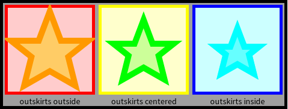
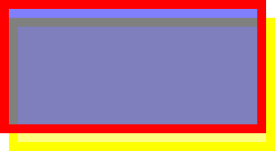
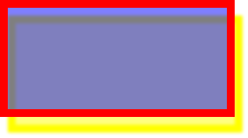
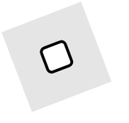

# Bloc & BlElement

## introduction

**Bloc** is the new graphical framework developped for Pharo. Initially
developped by Pharo team, it has been extended by Feenk team for GToolkit. Their
work is now being integrated back into **Pharo**. It should ultimately replace
the aging **Morphic** graphical framework,

To install it in Pharo 11, simply type in the playground

```smalltalk
[ Metacello new
baseline: 'Bloc';
repository: 'github://pharo-graphics/Bloc:dev-1.0/src';
onConflictUseIncoming;
ignoreImage;
load ]
on: MCMergeOrLoadWarning
do: [ :warning | warning load ].
```

Contrary to Morph, which relied a lot on inheritance to customize graphical
element, Bloc is designed to be composable. Basic bloc element can be
customized, and added to each other, to create high level component.

Bloc introduce new concept in the user interface. Previously, Pharo users
where used to talk about the **World** or **Morphic World**, which represent
the environment where we spend most of our time. With Bloc, we now deal with
**BlUniverse** and **BlSpace**. **BlSpace** is an operating system window in
which the Pharo systems is executed. If you have more than one BlSpace opened,
they will be listed as part of BlUniverse - a list of all available BlSpace in
your current Pharo session.

Let's create our first Bloc component. The root of all graphical element is
**BlElement**. You'll have to customize or subclass this element to create your
awesome graphical interface. Let's start with an easy one. Type this in the
playground

```smalltalk
BlElement new
geometry: BlRectangleGeometry  new;
size: 200 @ 100;
background: Color blue;
openInNewSpace
```

Once executed, a new window should appear on your desktop, with a white
background, and a blue rectangle inside. Let's look at it in more detail.

We first create a new BlElement. It's a blank element, and if you try to display
it, you won't see anything. We then define its geometry. The shape of your
element, in Bloc, is defined by its geometry. It's a simple rectangle in our
example, but it can be much more complicated. We'll look at geometry in more
detail later. We then define its size, its color, and then ask to open it in
a new space. As of this writing, it's not possible to open in Morphic World.

Element are stored in a tree-like structure. Each element is an instance of *BlElement*
the root element of Bloc.

## element shape & color

* geometry (bounds)
* border & outSkirts (outside, centered, inside)
* background

You can see each element as a *geometry* encasulated inside a hidden
rectangle (its bounds). The geometry is like a an invisible line on which
your drawing is represented. This drawing can happen outside (adding its border
size to the size of your element), centered, or inside.

### geometry of BlElement

Geometry will define the shape and the bounds of your element. Each element can
have only one geometry. There are several geometry figures available:
`BlElementGeometry allSubclasses`

Exemple of a polygon geometry, showing a star with 5 branches.

```Smalltalk
 geometry: (BlPolygonGeometry vertices: {
(50 @ 0).
(65 @ 40).
(100 @ 40).
(75 @ 60).
(85 @ 100).
(50 @ 80).
(15 @ 100).
(25 @ 60).
(0 @ 40).
(35 @ 40) });
```

Geometry define the shape of your BlElement. You already have many possibilities
defined as subclasses of **BlElementGeometry**

`BlElementGeometry allSubclasses`

As you can see, you already have a lot of geometry possibilities. If you were
used to the Morphic way of doing things, you'll notice a big difference here.

Bloc really favor BlElement composition to create your interface. Most of the
time, you will not have to create a custom painting of your element widget. You
can already do a lot with existing geometry. Ultimately, you can define
drawing methods on a canvas, but once drawn, a canvas cannot be easily inspected
for its elements. However, Bloc element composition create a tree of elements,
that can be inspected, and shaped dynamically.

Morphic was already capable of doing such things, but it was clearly an
afterthough of its creation. It was quite troublesome to define the layout of
different element together, especially when you have to manage resizing of your
element. Bloc offer a very nice way of creating custom component, and advanced
layout possibilities to mix all together.

When drawing with Athens or another vector canvas. you already noticed the
few primitives that we where using: lines, curves and bezier curves. Let's look
at associted geometry in detail to see how you can use them


## elements bounds& outskirts

- geometry (shape) and bounds (BlBounds)
  


- *Layout* bounds are drawn with gray dashed rectangles in the figure above. They are of this size in this particular example, because each element defines its size explicitly using **size:** method. Layout bounds are considered by layout algorithms to define mutual locations for all considered elements.

"Geometry" bounds are drawn with red dashed rectangles . The area is defined by minimum and maximum values of a polygon vertices. This does not take in account the border width, for example.

"Visual" bounds are drawn with blue rectangles in the figure above. It is an exact area occupied by an element. Computing visual bounds is the most expensive computation as it takes strokes and rendering into account.

If we specify BlOutskirts inside, visual bound and geometry bounds will be the same. But if BlOutskirts is outside, then visual bounds are larger than geometry bounds to take border width into its calculation.

see {{gtClass:BlGeometryVisualAndLayoutBoundsExamples}}

- BlDevElement new size:200@200;
geometry:( BlPolygon
  vertices:
   {(100 @ 50).
   (115 @ 90).
   (150 @ 90).
   (125 @ 110).
   (135 @ 150).
   (100 @ 130).
   (65 @ 150).
   (75 @ 110).
   (50 @ 90).
   (85 @ 90)});
background: (Color pink alpha:0.2);
border: (BlBorder paint: Color black width: 5);
outskirts: BlOutskirts outside"replace with inside to see the difference".

### element border 

- background (BlBackground). Paints (BlPaint) are used for background, border, text fill or stroke.

Short call: `border: (BlBorder paint: Color orange width: 5)`


Long call `BlBorder builder dashed; paint: Color red; width: 3; build`
`BlBorder builder paint: Color black;width: 10; dashArray: #(10 20);capSquare;build`


(BlBorder paint:((BlLinearGradientPaint direction: 1 @ 1)
matchExtent: 100 @ 75; from: Color blue to: Color red)
width: 5).
border: (BlBorder builder
paint: (borderColor alpha: 0.75) asBlPaint;
width: 10;
opacity: 0.5;
build);


### element background

quick set-up: `background: (Color red alpha: 0.8);`

background: (Color r: 63 g: 81           b: 181     range: 255);
background: ((BlLinearGradientPaint direction: 1 @ 1) from: Color red to: Color blue).
 
background: (BlRadialGradientPaint new
stops: { 0 -> Color blue. 1 -> Color red };
center: largeExtent // 2;
radius: largeExtent min;
yourself);

background: ((BlPaintBackground paint: fillColor asBlPaint) opacity: 0.75; yourself);


### element effect

`BlElementEffect allSubclasses`

```smalltalk
BlElement new
        size: 200 @ 100;
        geometry: (BlRoundedRectangleGeometry cornerRadius: 2);
        background: (Color red alpha: 0.2);
        border: (BlBorder paint: Color yellow width: 1);
        outskirts: BlOutskirts centered;
        effect:
            (BlSimpleShadowEffect color: Color orange offset: -10 @ -20)
```



effect: (BlSimpleShadowEffect
color: (Color orange alpha: shadowAlpha)
offset: shadowOffset);

```smalltalk
BlElement new
        size: 300 @ 150;
        geometry: (BlRoundedRectangleGeometry cornerRadius: 2);
        background: (Color blue alpha: 0.5);
        border: (BlBorder paint: Color red width: 10);
        effect: (BlGaussianShadowEffect color: Color yellow offset: 10@20 width: 5)
```



### element opacity

`element opacity:`, value between 0 and 1, 0 meaning completely transparent
You can apply opacity to background, border, or to your hole element.


## transformation
You can apply transformation to a BlElement:

- rotation
- translation
- Scaling
- reflection
- etc...

transformDo: [ :b | b scaleBy: 0.2; translateBy: -25 @ -15 ];

```smalltalk
aContainer := BlElement new
                    layout: BlFrameLayout new;
                    constraintsDo: [ :c |
                        c horizontal fitContent.
                        c vertical fitContent ];
                    padding: (BlInsets all: 20);
                    background: (Color gray alpha: 0.2).

node := BlElement new
            geometry: (BlRoundedRectangleGeometry cornerRadius: 4);
            border: (BlBorder paint: Color black width: 2);
            background: Color white;
            constraintsDo: [ :c |
                c frame horizontal alignCenter.
                c frame vertical alignBottom ];
            size: 20 @ 20.

aContainer transformDo: [ :t |
    t
        scaleBy: 2.0;
        rotateBy: 69;
        translateBy: 50 @ 50 ].
aContainer addChild: node.

aContainer forceLayout.
```



## Bloc styles

## element custom Painting

 creating and drawing your own block
=> subclass BlElement
=> Custom drawing is done with drawOnSpartaCanvas: method.
=>

BlElement >> aeFullDrawOn: aCanvas
"Main entry point to draw myself and my children on an Alexandrie canvas."

self aeDrawInSameLayerOn: aCanvas.

self aeCompositionLayersSortedByElevationDo: [ :each | each paintOn: aCanvas ].

Element geometry is taken care by:
BlElement >> aeDrawGeometryOn: aeCanvas
Painting is done on an Alexandrie Canvas, then rendered on the host:
BARenderer (BlHostRenderer) >> render: aHostSpace, display on a AeCairoImageSurface

Drawing is done through method 'drawOnSpartaCanvas', which receive a sparta
(vector) canvas as an argument.

1. aeDrawChildrenOn:
2. aeDrawOn:
3. aeDrawGeometryOn:

## UI Building

<https://github.com/OpenSmock/Pyramid/tree/main>
