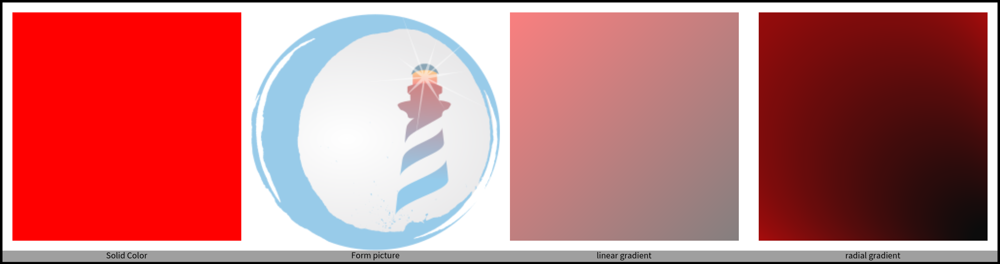
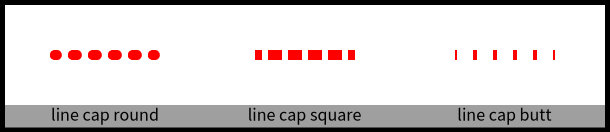
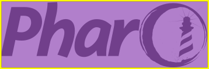
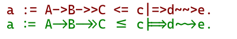
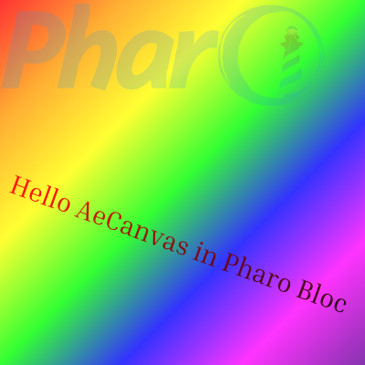

## BlElement

**Bloc** distinguishes itself by prioritizing object composition over
inheritance as its core design principle. This means that instead of relying
heavily on complex inheritance hierarchies, **Bloc** encourages building user
interface components by combining and customizing basic building blocks.

Note that Toplo is a new skinnable widget library built on top of Bloc.

### BlElement: The foundation of Bloc components

Every visual element within **Bloc** stems from the fundamental class
`BlElement`. This versatile class serves as the foundation upon which you can
construct more intricate components. By directly customizing and combining
`BlElement` instances, you gain granular control over the appearance and
behavior of your UI elements.

#### Navigating Bloc's spatial landscape

**Bloc** introduces two key concepts for managing the visual environment: 
`BlUniverse` and `BlSpace`. Imagine `BlUniverse` as a container housing a
collection of individual `BlSpace` instances. Each `BlSpace` represents a
distinct operating system window where your Pharo application unfolds. If you
have multiple windows open simultaneously, they'll be neatly organized within
the `BlUniverse`, providing a clear overview of your active spaces.

#### Ready to Build: Creating Your First Bloc Component

```smalltalk
blueRectangle := BlElement new
	geometry: BlRectangleGeometry  new;
	size: 200 @ 100;
	background: Color blue;
	yourself.
blueRectangle openInNewSpace
```


1. **Start with a blank canvas:** Begin by creating a new `BlElement`. 
This serves as the foundation for your user interface element, initially appearing
invisible.
2. **Define its shape:** In Bloc, the element's visual representation is
determined by its geometry. 
In this example, we'll use a simple rectangle, but more complex shapes are also possible (explored in further detail later).
3. **Set its dimensions and appearance:** 
Specify the element's size and color to customize its visual characteristics.
4. **Bring it to life:** Finally, open the element in a new space, making it visible on the screen.


In our example, we can observe the state of your element by inspecting the `blueRectangle` variable. We can observe a graphical overview of the element, as well as its state:


Elements are organized in trees. 
To compose tree of elements, we select a root element and we add children.

```smalltalk
redRectangle := BlElement new
	geometry: BlRectangleGeometry  new;
	size: 50 @ 50;
	background: Color red; 
	yourself.
blueRectangle addChild: redRectangle
```

1. **Start with a root element of your choice:** in our example, we reuse the `blueRectangle` element.
2. **Define the new element:** This is done like any other element, such as the `blueRectangle` element.
In this example, we will use a red rectangle, but smaller than the blue one.
3. **Add the new element as a child of the root element:** 
The `addChild:` api adds leaf elements to a root.
4. **Bring it to life:** If the `blueRectangle` is still open, it automatically updates with the `redRectangle`. Else, re-execute all the code to open the root in a new space, making it visible on the screen.


The red element is placed on the top left corner of its parent, the blue element.
By default, the position of `BlElement` instances is `0@0`.
The position of elements is configured by using the `position:` api, such as in the following:

```Smalltalk
redRectangle position: 75@25. 
```


Notice that if you did not close the original space opened for the `blueRectangle` element, the display automatically updates when the `redRectangle` position changes.

### Spaces: where elements are displayed

Spaces represent windows in which elements are displayed.
They are explicitely controlled by instantiating `BlSpace` objects.
A space has a root element, to which other elements are attached using the `addChild:` api.
In the following example, we create a new space in which we add our two rectangles:

```Smalltalk
space := BlSpace new.
space root addChild: blueRectangle.
space root addChild: redRectangle.
space show
```
An element can only be the child of a single other element.
If an element is already added as a child in a space, trying to add that element to a new space will raise an exception. 
One solution is to create new instances of that element to add it to another space.

### Exercise 1: color wall

Create a $10\times10$ grid of squares, each with a random color, and display it in a space (Figure *@fig:jointype@*).
 


### Geometry of BlElement

In Bloc, the visual form and boundaries of your UI elements are determined by their geometry. 
Each element can only possess a single geometry, essentially acting as a blueprint for its shape and size.
You can visualize an element as a specific geometry encapsulated within an invisible rectangular container, representing its overall *bounds*.

Bloc provides a diverse range of pre-defined geometry shapes accessible through `BlElementGeometry allSubclasses`. 
This comprehensive library empowers you to construct elements of varying complexities, from basic rectangles and circles to more intricate forms.

Bloc excels in facilitating the creation of custom components with advanced layout possibilities. 
Imagine building complex layouts by strategically arranging various elements, each defined by its unique geometry, to form a cohesive whole.

While the Alexandrie canvas provides a foundational set of building drawing primitives, Bloc offers a richer library of pre-defined shapes and the flexibility to construct even more intricate geometries.


* **Annulus**: `BlAnnulusSectorGeometry new startAngle: 225; endAngle: 360;   innerRadius: 0.3; outerRadius: 0.9);`
* **Bezier**: `BlBezierCurveGeometry controlPoints: { 5@0. 25@80. 75@30. 95@100 }`
* **Circle**: `BlCircleGeometry new matchExtent: 100 @ 50`
* **Ellipse**: `BlEllipseGeometry new matchExtent: 100 @ 50)`
* **Line**: `BlLineGeometry from: 10@10 to: 90@90`
* **Polygon** : `BlPolygonGeometry vertices: {(10 @ 10). (10 @ 90). (50 @ 50). (90 @ 90). (90 @ 10)}`
* **Polyline**: `BlPolylineGeometry vertices: {(10 @ 10). (10 @ 90). (50 @ 50).(90 @ 90). (90 @ 10) }`
* **Rectangle** : `BlRectangleGeometry  new`
* **Rounded rectangle**: `BlRoundedRectangleGeometry cornerRadius: 20`
* **Square**: `BlSquareGeometry new matchExtent: 70 @ 70`
* **Triangle**: `BlTriangleGeometry new matchExtent: 50 @ 100; beLeft`

### Element border

The geometry is like an invisible line on which your border is painted. The
painting is a subclass of `BlPaint`, and one of the three:

- solid color
- linear gradient color
- radial gradient color


Your border opacity can be specified as well: `opacity: 0.5;`

By default, your border will be a full line, but it can also be dashed, with
**dash array** and **dash offset**. Dash arrays define the number of element, and
dash offset, the space between elements.

You also have a pre-defined option, available in a single call:

- **dashed**
- **dashed small**


If the path is not closed, The style extent of your border can be defined with

- **cap square**
- **cap round**
- **cap butt**

Last, when the lines of your border cross each other, you can define the style of
the join as shown in Figure *@fig:jointype@*:

- **round join**
- **bevel join**
- **mitter join**


You have two options to define your border:

* short call: `element border: (BlBorder paint: Color orange width: 5)`
* with a builder:`element border: (BlBorder builder dashed; paint: Color red; width: 3; build)`

The first one is very helpful for solid line definition. The builder lets use
customize all the details of your border.

### Element bounds and outskirts

Bloc allow the user to select where they would like to draw the *border* of a region
around a shape; either along the inside, outside or centre of the shape.

Let's look at the different possible bounds of your element.

**Layout bounds** can be defined explicitly using `size:` method or dynamically
Layout bounds are considered by layout algorithms to define mutual locations
for all considered elements. You'll know more about layout later.

**Geometry bounds** area is defined by minimum and maximum values of polygon
vertices. This does not take in account the border width

**Visual bounds** is an exact area occupied by an element. it takes strokes
and rendering into account.

The geometry is like an invisible line on which your border is represented.
The border drawing can happen outside (adding its border size to the size of
your element), centered, or inside the geometry of the element. The final size
(geometry + border width) will define the **bounds** of your element.

In Figure *@fig:outskirts@*, the same exact star is drawn 3 times. The only difference is
the outskirts definition between those 3.


If we specify outskirts inside, visual bound and geometry bounds will be the
same. But if the outskirts is outside, then visual bounds are larger than
geometry bounds to take border width into its calculation.

### Element background

quick set-up: `background: (Color red alpha: 0.8);`

using rgb color

```smalltalk
background: (Color r: 63 g: 81 b: 181 range: 255);
```

using linear gradient

```smalltalk
background: ((BlLinearGradientPaint direction: 1 @ 1) from: Color red to: Color blue).
```

using radial gradient

```smalltalk
background: (BlRadialGradientPaint new
stops: { 0 -> Color blue. 1 -> Color red };
center: largeExtent // 2;
radius: largeExtent min;
yourself);
```

Using dedicated `BlPaintBackground` object.

```smalltalk
BlElement new 
	background: ((BlPaintBackground paint: Color red  asBlPaint) opacity: 0.75; yourself);
	openInSpace
```


### Element effect

You can get the list of all the effects available by executing: `BlElementEffect allSubclasses`

#### Simple shadow. 

```origin=BlocExamples>>shadow
BlElement new
	size: 200 @ 100;
	geometry: (BlRoundedRectangleGeometry cornerRadius: 2);
	background: (Color red alpha: 0.2);
	border: (BlBorder paint: Color yellow width: 1);
	outskirts: BlOutskirts centered;
	effect:
	    (BlSimpleShadowEffect color: Color orange offset: -10 @ -20)
```


Try the following variation.

```
effect: (BlSimpleShadowEffect
	color: (Color orange alpha: shadowAlpha)
	offset: shadowOffset);
```

#### Gaussian shadow.
The following produces the result shown in Figure *@fig:gaussian@*.

```smalltalk
BlElement new
	size: 300 @ 150;
	geometry: (BlRoundedRectangleGeometry cornerRadius: 2);
	background: (Color blue alpha: 0.5);
	border: (BlBorder paint: Color red width: 10);
	effect: (BlGaussianShadowEffect color: Color yellow offset: 10@20 width: 5)
```


### Element opacity

The element opacity is a value between 0 and 1, 0 meaning completely transparent.
You can apply opacity to a background, a border, or to your whole element.


### Element transformation

You can apply transformations to a `BlElement`:

- rotation
- translation
- scaling
- reflection
- etc...

Transformation are affine transformation. For more detail, you can search on the internet, there are countless references to it. To simplify it, I'll say we apply  a transformation matrix (*BlMatrix2D*) to all point of our figure path, each point represented as *BlVector*. 

You have 3 type of tranformation available in Bloc:
- **BlElementLocalTransformation**: This transformation combine an affine transformation (*BlAffineTransformation* subclasses), with a point of origin (*BlAffineTransformationOrigin* subclasses). By default, origin is the center of your element, BlAffineTransformationCenterOrigin.
- **BlElementAbsoluteTransformation**: This transformation apply a transformation matrix to your shape, without point of origin. Its  result is similar to *BlElementLocalTransformation*, with origin set to *BlAffineTransformationTopLeftOrigin*
- **BlElementCompositeTransformation** which are combination of *BlElementLocalTransformation* and/or *BlElementAbsoluteTransformation*

Most of the time, you won't have to deal with matrix definition. You'll use the 
helper method `transformDo`, and define your transformation using *BlTransformationBuilder*.

When you're defining a transformation using `transformDo:` , you'll, by default, 
use *BlAffineCompositeTransformation*. All transformation move added subsequently will be composed together.
The origin will be set to *BlAffineTransformationCenterOrigin*.

Those two transformation below are strictly equivalent, and rotate your element by 45 degree. 
One use the underlying object, while the other use the helper methods:

```smalltalk
elt transformation: (BlElementLocalTransformation 
	newWith: ((BlRotationTransformation new angle: 45) 
	origin: (BlAffineTransformationCenterOrigin defaultInstance ) )).
```

```smalltalk
elt transformDo: [ :t | t rotateBy: 45 ].
```

A transformation is applied in the scope of the message `transformDo:` as shown below.
```
element transformDo: [ :b | b scaleBy: 0.2; translateBy: -25 @ -15 ];
```
The following script produces *@fig:transform@*.

it sets the scale to 0.2 and translate by -25@15, it doesn't scale it by 0.2.
each time you execute it. If you want to append try: `builder inherit scaleBy: 0.2`.
`transformDo:` creates a new transformation from the commands in the block closure

```smalltalk
aContainer := BlElement new
		layout: BlFrameLayout new;
		constraintsDo: [ :c |
			c horizontal fitContent.
			c vertical fitContent ];
		padding: (BlInsets all: 20);
		background: (Color gray alpha: 0.2).

node := BlElement new
	geometry: (BlRoundedRectangleGeometry cornerRadius: 4);
	border: (BlBorder paint: Color black width: 2);
	background: Color white;
	constraintsDo: [ :c |
		c frame horizontal alignCenter.
		c frame vertical alignBottom ];
	size: 20 @ 20.

aContainer transformDo: [ :t |
	t
		scaleBy: 2.0;
		rotateBy: 69;
		translateBy: 50 @ 50 ].
		
aContainer addChild: node.
aContainer forceLayout.
```


transform is something extra that is applied on top of position. For example if
you want to have a short of animation, you would use transform as it is not 
taken into account by layouts

#### Transform catches

The message `transformDo:` can be applied at any moment during the life of an object.
You can use any static or pre-computed properties with `transformDo:` as in the following snippet.
Here ` -25 asPoint` does not depend on the child or parent size.

```
| child parent |
child := BlElement new 
	background: Color lightBlue; 
	geometry: BlCircleGeometry new;
	yourself.
 
child position: 100@100.
child  transformDo: [ :t | t translateBy: -25 asPoint ].

parent := BlElement new 
	size: 200 asPoint; 
	addChild: child;
	background: Color lightRed.

parent openInSpace.
```

**Important.**
if you want to use dynamic layout properties (such as `size`) with `transformDo:`, you need to wait for layout phase to be completed using `whenLayoutedDoOnce:`.
Compare the two examples below:

```
| child parent |
child := BlElement new 
	background: Color lightBlue; 
	geometry: BlCircleGeometry new;
	yourself.
 
child position: 100@100.
child transformDo: [ :t | t translateBy: child size negated / 2 ];

parent := BlElement new 
	size: 200 asPoint; 
	addChild: child;
	background: Color lightRed.

parent openInSpace.
```


```
| child parent |
child := BlElement new 
	background: Color lightBlue; 
	geometry: BlCircleGeometry new;
	yourself.
 
child position: 100@100.

parent := BlElement new 
	size: 200 asPoint; 
	addChild: child;
	background: Color lightRed.

parent whenLayoutedDoOnce: [ 
	child  transformDo: [ :t | t translateBy: (child size negated / 2) ]  ].

parent openInSpace.
```` 


### Element custom painting (more here)

Bloc favors `BlElement` composition to create your graphical interface. 
Most of the time, you will not have to create a custom painting of your element widget. 
You can already do a lot with existing geometry.

Ultimately, you can define drawing methods on a canvas, but once drawn, a canvas cannot 
be easily inspected for its elements. 
However, Bloc element composition creates a tree of elements, that can be inspected, and shaped dynamically.

Creating and drawing your element
- subclass `BlElement`
- custom drawing is done with `aeFullDrawOn:` method. Note that 'ae' stands for the Alexandrie canvas. 

This Canvas is been specifically designed for drawing Bloc element. It's not as complete
as Alexandrie Cairo Canvas, which is the closest to the underlying Cairo libray

You can see the `aeFullDrawOn:`
```
BlElement >> aeFullDrawOn: aCanvas
	"Main entry point to draw myself and my children on an Alexandrie canvas."

	self aeDrawInSameLayerOn: aCanvas.
	self aeCompositionLayersSortedByElevationDo: [ :each | each paintOn: aCanvas ].
```

Element geometry is taken care by the method `aeDrawGeometryOn: aeCanvas`.
Painting is done on an Alexandrie canvas, then rendered on the host
by the method `BARenderer (BlHostRenderer) >> render: aHostSpace` which displays it on a `AeCairoImageSurface`.

Drawing is done through method 'xxx', which receives an Alexandrie
(vector) canvas (`AeCanvas`) as an argument.

1. `aeDrawChildrenOn:`
2. `aeDrawOn:`
3. `aeDrawGeometryOn:`

To draw a figure, prepare the canvas using set* methods in the API protocol,
using this order:

1. set up path
2. set up background
3. set up border and outskirts
4. send a variant of drawFigure*
drawFigureAndPrepareToClip: true
ou
drawFigure. which set clip to false.

Drawing example -  draw hour tick around a circle 
```
aeDrawOn: aeCanvas
	"draw clock tick on frame"

	super aeDrawOn: aeCanvas.

	aeCanvas setOutskirtsCentered.

	0 to: 11 do: [ :items |
		| target |
		target := (items * Float pi / 6) cos @ (items * Float pi / 6) sin.

		items % 3 == 0
			ifTrue: [
				aeCanvas pathFactory: [ :cairoContext |
					cairoContext
						moveTo: center;
						relativeMoveTo: target * 115;
						relativeLineTo: target * 35;
						closePath ].

				aeCanvas setBorderBlock: [
					aeCanvas
						setSourceColor: Color black;
						setBorderWidth: 8 ] ]
			ifFalse: [
				aeCanvas pathFactory: [ :cairoContext |
					cairoContext
						moveTo: center;
						relativeMoveTo: target * 125;
						relativeLineTo: target * 25;
						closePath ].

				aeCanvas setBorderBlock: [
					aeCanvas
						setSourceColor: Color black;
						setBorderWidth: 6 ] ].
		aeCanvas drawFigure ]
```

Let's do it one by one.

1. set up path

```smalltalk
	canvas pathFactory: [ :cairoContext |
		cairoContext
			moveTo: 50 @ 50;
			lineTo: 150 @ 50;
			closePath ].
```

You'll find the usual path verb to draw line, bezier curve, arc, and absolute
or relative move. Take a look at **AeCaireContext** class in the *API - Path* 
protocol for all possibilities.

 
2. set up background



- Solid background: `canvas setBackgroundWith: [ canvas setSourceSolidColor: Color  red]`
- Form background: `canvas setBackgroundWithForm: form`
- linear color: `canvas setBackgroundWith: [ canvas setSourceLinearPatternStops: {	(0 -> Color red). (1 -> Color black) } 	start: 0 @ 0end: 500 @ 500 ] `
- radial color: `canvas setBackgroundWith: [ canvas setSourceRadialPatternStops:  {
(0 -> Color red). (1 -> Color black) }
innerCenter: 50 @ 50 innerRadius: 500
outerCenter: 480 @ 480 outerRadius:  30 ]`


1. set up border and outskirts

You need to specify the position of the border, or of there are no border:

- `canvas setOutskirtsCentered .`
- `canvas setOutskirtsInside .`
- `canvas setOutskirtsOutside .`
- `canvas setBorderOff`

You can of course set the line cap


and the line join


Bloc allow the user to select where they would like to draw the *border* of a region
around a shape; either along the inside, outside or centre of the shape. This
is controled throught the outskirts parameter.
`PathFactory:` is used by default to paint the border (stroke) and the inside (fill)
of your element. If you want to manage different outskirts, you can refine the
definiton of the border path with `borderPathFactory:` canvas method by overwriting
`aeApplyWithInsideBorderTo: aeCanvas element: aBlElement borderWidth: aWidth` 
and `aeApplyWithInsideBorderTo: aeCanvas element: aBlElement borderWidth: aWidth`
to specify the border path of your element.

1. send a variant of drawFigure*

You can manage to draw your figure using a mask to reach interesting effect like


```smalltalk
| canvas form |
form := PolymorphSystemSettings pharoLogoForm.

canvas := AeCanvas extent: form extent.

canvas setBorderBlock: [
	canvas
		setSourceColor: Color yellow;
		setBorderWidth: 5.0 ].
canvas setOutskirtsCentered.

canvas maskGroupWith: [
	canvas pathFactory: [ :cairoContext |
		cairoContext rectangleTo: form extent ].
	canvas setBackgroundWithForm: form alpha: 0.5.
	canvas drawFigure ].

canvas pathFactory: [ :cairoContext | cairoContext rectangleTo: form extent ].
canvas setBackgroundWith: [ canvas setSourceColor: (Color purple alpha: 0.5) ].
canvas drawFigure.

^ canvas asForm
```
or


```smalltalk
| canvas |
canvas := AeCanvas extent: 150 @ 150.

canvas maskGroupWith: [
	canvas pathTranslate: 10 @ 20.
	canvas pathFactory: [ :cairoContext |
		cairoContext
			moveTo: 10 @ 10;
			lineTo: 100 @ 10;
			lineTo: 100 @ 100;
			lineTo: 10 @ 100;
			closePath ].
	canvas setBorderBlock: [
		canvas
			setSourceColor: (Color orange);
			setBorderWidth: 5.0 ].
	canvas setOutskirtsCentered.
	canvas setBackgroundWith: [
		canvas setSourceColor: (Color orange alpha: 0.5) ].
	canvas drawFigure ].

canvas pathFactory: [ :cairoContext |
	cairoContext
		moveTo: 10 @ 10;
		lineTo: 100 @ 10;
		lineTo: 100 @ 100;
		lineTo: 10 @ 100;
		closePath ].
canvas setBorderBlock: [
	canvas
		setSourceColor: Color yellow;
		setBorderWidth: 5.0 ].
canvas setOutskirtsCentered.
canvas setBackgroundWith: [
	canvas setSourceColor: (Color red alpha: 0.5) ].
canvas drawFigure.

^ canvas asForm
```

You can also manage text directly in the AeCanvas, like this (You'll find more
detailled explanation on harfbuzz in the text chapter in the Alexandrie part)



```smalltalk
| aManager aFace aeCanvas cairoScaledFont fontHeight string  |
"font definition"
AeFontManager resetGlobalInstance.
aManager := AeFontManager globalInstance.
aManager
	scanDirectory: AeFilesystemResources fontsDirectory;
	scanEmbeddedFonts.

aFace := aManager
				detectFamilyName: 'Cascadia Code'
				slant: AeFontSlant normal
				weight: AeFontWeight normal
				stretch: AeFontStretch normal
				ifNone: [
				self inform: 'missing font' ].

string := 'a := A->B->>C <= c|=>d~~>e.'.
fontHeight := 22.

aeCanvas := AeCanvas extent: 1000 @ (fontHeight * 4).
aeCanvas clear: Color white.

cairoScaledFont := aeCanvas scaledFontForFace: aFace size: fontHeight.

"Margin"
aeCanvas pathTranslate: fontHeight / 2 @ 0.

"Draw text withOUT Harfbuzz:"
aeCanvas pathTranslate: 0 @ (fontHeight * 1.1).
aeCanvas setSourceColor: Color red muchDarker.
aeCanvas
	drawGlyphs: (cairoScaledFont glyphArrayForString: string)
	font: cairoScaledFont.

"Draw text with Harfbuzz:"
aeCanvas pathTranslate: 0 @ (fontHeight * 1.1).
aeCanvas setSourceColor: Color green muchDarker.
aeCanvas
	drawGlyphs: (AeHbBuffer new
				direction: AeHbDirection leftToRight;
				script: AeHbScript latin;
				language: AeHbLanguage en;
				clusterLevel: AeHbBufferClusterLevel recommended;
				flags: AeHbBufferFlags beginningOrEndingOfText;
				addString: string;
				cairoGlyphArrayForFace: aFace size: fontHeight)
	font: cairoScaledFont.

^ aeCanvas asForm
```

A full example with all possibilities:



```smalltalk
| aManager aFace aeCanvas cairoScaledFont fontHeight paint anAlexandrieCanvasExperiment |
anAlexandrieCanvasExperiment := self new.
aeCanvas := AeCanvas extent: 400 @ 400.
aeCanvas clear: Color white.

paint := PolymorphSystemSettings pharoLogoForm.

"--------------------------------"
aeCanvas pathFactory: [ :cairoContext |
	cairoContext rectangle: (0 @ 0 rectangle: 400 @ 400) ].

aeCanvas setBackgroundWith: [
	aeCanvas
		setSourceLinearPatternStops: {
				(0 -> (Color red alpha: 0.8)).
				(0.166 -> (Color orange alpha: 0.8)).
				(0.332 -> (Color yellow alpha: 0.8)).
				(0.5 -> (Color green alpha: 0.8)).
				(0.664 -> (Color blue alpha: 0.8)).
				(0.83 -> (Color magenta alpha: 0.8)).
				(1 -> (Color purple alpha: 0.8)) }
		start: 0 @ 0
		end: 400 @ 400 ].
aeCanvas setBorderOff.
aeCanvas drawFigure.

"--------------------------------"

aeCanvas pathFactory: [ :cairoContext |
	cairoContext rectangleTo: paint extent ].
aeCanvas setBackgroundWithForm: paint alpha: 0.2.
aeCanvas drawFigure.

aManager := AeFontManager globalInstance.
aManager
	scanDirectory: AeFilesystemResources fontsDirectory;
	scanEmbeddedFonts.

fontHeight := 25.
aFace := aManager
				detectFamilyName: 'Inria Serif'
				slant: AeFontSlant normal
				weight: AeFontWeight normal
				stretch: AeFontStretch normal
				ifNone: [
				anAlexandrieCanvasExperiment inform: 'missing font' ].

cairoScaledFont := aeCanvas scaledFontForFace: aFace size: fontHeight.

aeCanvas pathTransform: (AeCairoMatrix
			newX: 20
			y: 180
			sx: 1.2
			sy: 1.2
			shx: -25 degreesToRadians
			shy: 25 degreesToRadians).

aeCanvas pathTranslate: 0 @ (fontHeight * 1.1).
aeCanvas
	setSourceLinearPatternStops: {
			(0 -> (Color white alpha: 0.9)).
			(1 -> (Color black alpha: 0.9)) }
	start: 0 @ 0
	end: 100 @ 150.
aeCanvas
	drawGlyphs:
	(cairoScaledFont glyphArrayForString: 'Hello Alexandrie in Pharo')
	font: cairoScaledFont.

^ aeCanvas asForm
```
### Exercise: lights wall
Transform your color grid from Figure*@fig:colorWall@* to a wall of lights such as in Figure *@fig:lightsWall@*:
- compose elements to add circles to the squares
- build and add glowing effects to the circles

Do not hesitate to explore the various effects and their configuration!


### Conclusion

`BlElement` is defining a large spectrum of element functionalities. 
The following chapters will cover layout, event handling, animations and more. 
