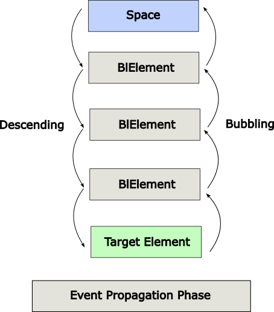

## Event handling

In graphical applications, whenever a user interacts with the application (BlElements),
an event is said to have been occurred. For example, clicking on a button, moving
the mouse, entering a character through keyboard, selecting an item from list, etc.
are the activities that causes an event to happen.

Bloc provides support to handle a wide varieties of events. The class named
*BlEvent* is the base class for an event. An instance of any of its subclass
is an event. Some of them are are listed below.

- **Mouse Event**  − This is an input event that occurs when a mouse is clicked. It includes actions like mouse clicked, mouse pressed, mouse released, mouse moved, etc.
- **Key Event** − This is an input event that indicates the key stroke occurred on an element. Those events includes actions like key pressed, key released and key typed.
- **Drag Event** − This occurs when an Element is dragged by mouse. It includes actions like drag entered, drag dropped, drag entered target, drag exited target, drag over, etc.

Event Handling is the mechanism that controls the event and decides what should
happen, if an event occurs. This mechanism has the code which is known as an 
event handler that is executed when an event occurs.

Bloc provides handlers and filters to handle events. Every event has:

- Target − The element on which an event occurred.
- Source - Used in drag&drop to identify the source element.
- Type − Type of the occurred event

In this example, the background of the element will change when the mouse will
enter or leave the element.

```smalltalk
BlElement new 
  background: Color white; 
  border: (BlBorder paint: Color black width: 2); 
  size: 300 @ 200;
  addEventHandlerOn: BlMouseEnterEvent do: [ :anEvent | anEvent consumed: true. anEvent currentTarget background: Color veryVeryLightGray];
  addEventHandlerOn: BlMouseLeaveEvent do: [ :anEvent | anEvent consumed: true. anEvent currentTarget background: Color white ]; 
  openInNewSpace 
```

### About event bubbling

We should check `example_mouseEvent_descending_bubbling`




#### Event Capturing Phase

This event travels to all elements in the dispatch chain (from top to bottom), 
starting from *BlSpace*. If any of these element has a handler for this event, 
it will be executed, until it reach the target element which can process it.

#### Event Bubbling Phase

In the event bubbling phase, the event is travelled from the target element to 
BlSpace (bottom to top). If any of the element in the event dispatch chain has a 
handler registered for the event, it will be executed. When the event reaches 
the BlSpace element the process will be completed.

##### stop event propatation

You can stop the event propagation in an event handler by adding
`anEvent consumed: true.`

##### prevent event capture

Sometime, you don't want your element to capture event. There is an option to
forbid mouse events for an element. You just send *#preventMouseEvent* to it.

In the example below, *child2* will not capture mouse events.

```smalltalk
container := BlElement new size: 500 asPoint; border: (BlBorder paint: Color red width: 2).

child1 := BlElement new size: 300 asPoint; background: Color lightGreen; position: 100 asPoint; addEventHandlerOn: BlClickEvent do: [ self inform: '1' ]; yourself .

child2 := BlElement new size: 200 asPoint; position: 200 asPoint; border: (BlBorder paint: Color blue width: 2);preventMouseEvents.

container addChild: child1.
container addChild: child2.

container openInSpace.
```

You can also prevent element and its children to capture event, with *#preventMeAndChildrenMouseEvents*
message, or apply it only to its children with *#preventChildrenMouseEvents*


#### Event Handlers

Event handlers are those which contains application logic to process an event. 
An element can register more than one handler.

##### Simple case for BlElement.

1. use method: `BlElement>>addEventHandlerOn:do:`
2. anEventClass can be a subclass of `BlUIEvent`

**Note**
`addEventHandlerOn:do:` returns the new handler so that we can store to remove
it in case. **Add a #yourself send after to return a BlElement.**

When adding two event handlers on the same event for the same element, event handler
will be executed sequentialy. the order of processing will match event handler declaration order.

If you want a single time action, you can use the message `#addEventHandlerOn: doOnce:`.
It'll add an event handler that will be removed right before culling the received block closure.

##### Complex case - reusing event handling logic with an event Handler

Instead of using addEventHandlerOn:do: you can also see users of `addEventHandler:`.
An event handler can manage multiple element at once, by overriding the method `eventsToHandle`

This example is taken from `BlPullHandler` which demonstrate how you can dra around an
element (more on this at the end of this chapter)

```smalltalk
eventsToHandle
^ {	BlDragStartEvent. BlDragEvent. BlDragEndEvent }
```

You then add your event handler to your bloc element with method `addEventHandler:`.
This allows complete flexibility.

You can also declare dynamically event handler on specific event.

```smalltalk
BlEventHandler on: BlClickEvent do: [ :anEvent | self inform: 'Click!' ]
```

As a more general explanation, all UI related events can be controlled. Have a
look at *BlElementFlags* and *BlElementEventDispatcherActivatedEvents* and how
these classes are used.

```smalltalk
deco addEventHandler: (BlEventHandler on: BlMouseLeaveEvent
      do: [ :event | event currentTarget border: BlBorder empty ]).
```

You can of course remove event handler associated with a specific element with
the method `#removeEventHandler:`. In the example below, the handler will be 
removed on the first key pressed on the element

```smalltalk
	|handler|
	
	handler := (BlEventHandler on: BlKeyDownEvent
				   do: [ :anEvent | self inform: 'Key down: ' , anEvent key asString.
						anEvent currentTarget removeEventHandler:handler. ]).
  BlElement new size: 200 @ 200; background: Color red; addEventHandler: handler;
		  requestFocus; openInNewSpace
```

If you create a new custom handler class that deals with multiple events and add it dynamically
to your element, you can go back to the original state later by removing the new 'dynamically-added event' by simply using its reference. You can check if your element has a specific event handler with `#hasEventHandler:`. You can also avoid adding twice the same event handler with `#addEventHandlerIfNotPresent:`. There is no way to disable an event handling temporary.
If you want to achieve such behavior, you should first remove its event handler, and
add it again later.

#### event filters

You can also add event filter:

`addEventFilterOn:do:` returns the new handler so that we can store to remove it in case.
Event filters receive events before general event handlers. Their main goal is
to prevent some specific events from being handled by basic handlers. For that
custom filters should mark event as *consumed: true* which instantly stops propagation

In the example below, the element will catch `BlMouseEnterEvent`. If you uncomment
`anEvent consumed: true`, you'll only have the filtered version. If the event keep
propagating, both will be called, filter and then handler.

```smalltalk
addEventFilterOn:  BlMouseEnterEvent do: [ :anEvent | "anEvent consumed: true". self inform: 'event filter'];
addEventHandlerOn:  BlMouseEnterEvent do: [ :anEvent | "anEvent consumed: true". self inform: 'event handler' ];
```

#### event tips

##### Event inheritance.

 `BlPrimaryClickEvent`, `BlMiddleClickEvent` and `BlSecondaryClickEvent` are all subclasses of `BlClickEvent`. In Bloc logic, event handler will look for event that are from the defined event class, or inherit from its  parent (exact code is ` anEvent class == self eventClass or: [ anEvent class inheritsFrom: self eventClass ] `. For example, If you define handler for both `BlClickEvent` and `BlPrimaryClickEvent` on your element, and you left click on it, it will raise `BlPrimaryClickEvent`. Because `BlPrimaryClickEvent`inherit from `BlClickEvent`, both will be handled.

In the example below, 'click' will be raised, whatever the mouse button you use to click on your element.

```smalltalk
elt := BlElement new extent: 200@200; border: (BlBorder paint: (Color black) width: 3 ); background: (BlBackground paint: Color blue).

elt addEventHandlerOn: BlClickEvent do: [  self inform: 'click' ].
elt addEventHandlerOn: BlPrimaryClickEvent do: [  self inform: 'Primary' ].
elt addEventHandlerOn: BlSecondaryClickEvent do: [ self inform: 'secondary' ].
elt addEventHandlerOn: BlMiddleClickEvent do: [ self inform: 'middle' ].

elt openInNewSpace 
```

A similar effect can be achieve with:

```smalltalk
elt := BlElement new extent: 200 @ 200; border: (BlBorder paint: Color black width: 3); background: (BlBackground paint: Color blue).
elt addEventHandlerOn: BlClickEvent do: [ :evt | evt primaryButtonPressed ifTrue: [ self inform: 'primary' ] ].
elt addEventHandlerOn: BlClickEvent do: [ :evt | evt secondaryButtonPressed ifTrue: [ self inform: 'secondary' ] ].
elt addEventHandlerOn: BlClickEvent do: [ :evt | evt middleButtonPressed ifTrue: [ self inform: 'middle' ] ].
elt openInNewSpace
```

In the first way, you tell explicitely which mouse button event you want to catch. In the second, you have to filter it in the handler action.

##### Remove all eventHandlers from a Blelement?

```smalltalk
el removeEventHandlersSuchThat: [:e|true] 
```

or

```smalltalk
el eventDispatcher removeEventHandlers
```

##### using mouse wheels

In this snippet, we'll use the mouse wheel to scale up or down the element

```smalltalk
scaleFactor := 0.
surface addEventHandlerOn: BlMouseWheelEvent
        do: [ :anEvent | anEvent consumed: true.
              anEvent isScrollDown ifTrue:  [ scaleFactor := scaleFactor- 0.5 ].
              anEvent isScrollUp ifTrue:  [ scaleFactor := scaleFactor + 0.5 ].
              elt transformDo: [ :t | t scaleBy: scaleFactor].].
```

### Keyboard event handling -  Combination from Bloc framework

Bloc come with its own keymapping framework.*BlShortcutWithAction* would be the equivalent of KMKeymap in current Pharo image.

Shortcut represents a keyboard shortcut that can be registered to any arbitrary BlElement.
Shortcut consist of an Action that is evaluated when a Shortcut is triggered and
BlKeyCombination that describes when shortcut should be triggered. A combination
is a logical formula expression that is composed of various key combinations
such as alternative, compulsory or single key. See subclasses of BlKeyCombination.
Additionally, shortcut may provide its optional textual description and name.

A shortcut can be added or removed from the element by using `BlElement>>#addShortcut:`
or `BlElement>>#removeShortcut:` methods. `BlElement>>#shortcuts` message can be
sent to an element in order to access a list of all registered shortcuts.

*BlShortcutWithAction* extend *BlBasicShortcut* with ability to specify a runtime
action that should be evaluated when shortcut is performed. In addition to that,
shortcuts with action allow users to customise the name and description of the shortcut.

```smalltalk
BlShortcutWithAction new
    combination: (BlKeyCombination builder alt; control; key: KeyboardKey C; build);
    action: [ flag := true ].
```

To add a shortcut to an element:

```smalltalk
addShortcut: (BlShortcutWithAction new
      combination: (BlKeyCombination builder shift; key: KeyboardKey left; build);
      action: [ :anEvent :aShortcut | self inform: 'Triggered ', aShortcut combination asString ]);
```

For a single key combination, you can use *BlSingleKeyCombination* like: 

```smalltalk
addShortcut: (BlShortcutWithAction new
      combination: (BlSingleKeyCombination new key: KeyboardKey left);
      action: [ :anEvent :aShortcut | self inform: 'Triggered ', aShortcut combination asString ]);
```

For *alternative* key combination, there is *BlAlternativeCombination* which
represent an alternative "OR" combination of multiple distinct keys. (disjunction)

It's very useful to support shortcuts that treat different keyboard keys as identical.
For example there might be two SHIFT keys: SHIFTL (left shift) and SHIFTR (right shift). In most cases for the end user there should be no difference between those two.

Here is an example of how to unify two shifts:

```smalltalk
BlAlternativeCombination new
key: Key leftShift;
key: Key rightShift;
yourself
```

Unified meta (cmd):

```smalltalk
BlAlternativeCombination new
with: (BlSingleKeyCombination key: Key leftMeta);
with: (BlSingleKeyCombination key: Key rightMeta);
yourself
```

You also have *BlCompulsoryCombination* which represent a compulsory "AND" combination of multiple distinct keys. (conjunction). It's useful when there is a need to create a key combination that should be matched when all subcombinations are matching.

Example of a key combination that matches then and only then when both "arrowLeft" and "W" are pressed:

```smalltalk
BlCompulsoryCombination new
key: Key arrowLeft;
key: Key w;
yourself
```

Unified meta (cmd):

```smalltalk
BlCompulsoryCombination new
with: (BlSingleKeyCombination key: Key arrowLeft);
with: (BlSingleKeyCombination key: Key w);
yourself
```

You can of course specify key management using low level event. It should be obvious
to the reader it's not the prefered way, and we should prefer proper object to handle
keyboard key.

```smalltalk
space addEventHandlerOn: BlKeyDownEvent
	do: [ :evt |
		(evt key = KeyboardKey altLeft or: [
			evt key = KeyboardKey altRight ]) ifTrue: [
			self inform: 'source 1 alt key pressed' ] ].
```

When handling event, you can check if a specific modifier key (alt, ctrl, shift) has
been pressed with the *modifiers* message, like:

```smalltalk
elt addEventHandlerOn: BlDragEvent do: [ :event | event modifiers isAlt ifTrue: [self inform: 'alt']].
```

This will catch all modifier pressed. For example If you specify *isCtrl* but you don't want *ctrl+shift+alt* to react, you will need to specify `isAlt and: isShift not and: isCmd not`

### Drag and Drop

Explore BlBaseDragEvent and subclasses.

Full drag&drop example

2 hints:
1. to allow drop event to reach other element, you have to sent `preventMeAndChildrenMouseEvents` to dragged element.
2. To allow dragged element to stay on top of the other, you must:
   1. remove it `removeFromParent`
   2. add it to the top most element. `space root addChild:`
  
```smalltalk
| source1 source2 target space offset |
space := BlSpace new.
source1 := BlElement new size: 100 @ 100; background: Color red; border: (BlBorder paint: Color gray width: 2); position: 0@0.
source2 := BlElement new size: 100 @ 100; background: Color purple; border: (BlBorder paint: Color gray width: 2); position: 150@0.
target := BlElement new size: 100 @ 100; background: Color blue; border: (BlBorder paint: Color gray width: 2); position: 500 @ 500.

space root addChildren: { source1. source2. target. }.

source1 addEventHandlerOn: BlDragStartEvent do: [ :event | event consumed: true. self inform: 'source1 BlStartDragEvent'. 
	offset := event position - source1 position. 
	source1 removeFromParent.].
source1 addEventHandlerOn: BlDragEndEvent do: [ :event | event consumed: true. self inform: 'source1 BlDragEndEvent'. ].
source1 addEventHandlerOn: BlDragEvent do: [ :event | event consumed: true. "self inform:  'source1 BlDragEvent'."
	source1 position: event position - offset.
	source1 hasParent ifFalse: [space root addChild: source1].
	source1 preventMeAndChildrenMouseEvents ].

source2 addEventHandlerOn: BlDragStartEvent do: [ :event | event consumed: true. self inform: 'source2 BlStartDragEvent'. 
	offset := event position - source2 position.
	source2  removeFromParent.].
source2 addEventHandlerOn: BlDragEndEvent do: [ :event | event consumed: true. self inform: 'source2 BlDragEndEvent'. ].
source2 addEventHandlerOn: BlDragEvent do: [ :event | event consumed: true. "self inform:  'source BlDragEvent'."
	source2 position: event position - offset.
	source2 hasParent ifFalse: [space root addChild: source2].
	source2 preventMeAndChildrenMouseEvents ].

target addEventHandlerOn: BlDropEvent do: [ :event | event consumed: true. self inform: 'target BlDropEvent'.
	event gestureSource background paint color = (Color red)
			ifTrue: [ self inform: 'drop accepted' ]
			ifFalse: [ self inform: 'drop rejected'. event gestureSource position: 100 @ 400; allowMeAndChildrenMouseEvents] ].
target addEventHandlerOn: BlDragEnterEvent do: [ :event | event consumed: true. self inform: 'target BlDragEnterEvent' ].
target addEventHandlerOn: BlDragLeaveEvent do: [ :event | event consumed: true. self inform: 'target BlDragLeaveEvent' ].

space show
```

You can catch modifier while dragging your element. This will catch the 'Alt' key
during a drag event.

```smalltalk
elt addEventHandlerOn: BlDragEvent do: [ :event | event modifiers isAlt ifTrue: [self inform: 'alt']].
```

#### BlPullHandler

If you just need to drag an element around, use `BlPullHandler` which is
a specialized event handler.

```smalltalk
parent := BlElement new background: Color lightGreen; size: 600 asPoint.
elt := BlElement new background: Color red; size: 100 asPoint.
parent addChild: elt.

elt addEventHandler: BlPullHandler new disallowOutOfBounds.

parent openInSpace.
```
