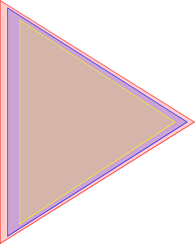

# Bloc Layout

## introduction

Widget are not composed of one single element. If you want to have more complex
bloc element, you'll need to combine them together. Each element can be build
and inspected individually, which is good for development purpose. If you want
to build a full graphical interface, you'll need to combine element with each
others, or at at least add it to a *space*.

Element in a bloc scene are added to each other, ending in a tree-like structure
where parents and children can identify each other. Each element have its own
visual properties, like background, border, geometry, etc. How all elements will
end up showing depend of the graphical properties of each element, and how all
of them are layout together.


Layout is one of fondamentals feature of *Bloc*. Instead of *drawing* your whole
widget in a single method, it encourage you to build small element with specific
geometry and visual properties and combine them using various layout strategy.
The layout property define the visual agencement of the element and its
children. It defines the position and size of child and grand-child elements
within the parent. It can also have an impact on the size of the parent element.

Element are stored in a tree-like structure. Each element is an
instance of *BlElement* the root element of Bloc.

When defining layout, 2 parts must be combined to play together: *parent* and
*children* elements.

* Parent define which layout strategy to apply to their children
* children specify which constraints they will follow, which could impact their
position and their size.

Layout are defined by their *type* and they *constraints*. Type are usually
defined by at the parent level with **layout** method, while you can specify
contraints to your child element using the **constraintsDo:** message, which
support a set of attributes which define the visual properties of the layout. A
small set of constraints, like padding, margin or minimal and maximum
dimensions, are common among all the layouts. Constraints allows you to clearly
defined the size and the position of your element withing its parent.

### element combination

Elements can be combined with the **addChild:** method. You can add multiple
elements at once with **addChildren:**. You can of course remove sub-element
with **removeChild:** and **removeChildren:** method.

Look at **children add/remove** protocol of *BlElement* for all available method
to manage addition and removal of the elements composing your widget.

### space around elements

Before jumping on the defintion of the position of each element, you can already
define how close your element will be from each other, with those 2 properties

* **padding:** space between the element and its children.
* **margin:** space between the element and its parent

Constraint can apply to margin and padding as well,
as `constraintsDo: [ :c | c margin: (BlInsets all: 10) ])`

```smalltalk
    container := BlElement new
                 "no dynamic constraints, we specify element size"
                size: 400 @ 400;
                border: (BlBorder paint: Color red width: 1);
                background: (Color red alpha: 0.2);
                layout: BlFlowLayout horizontal alignCenter.

    element := BlElement new
                   border: (BlBorder paint: Color blue width: 1);
                   background: (Color blue alpha: 0.2);
                   margin: (BlInsets all: 15);
                   padding: (BlInsets all: 35);
                      "element has a child, specify its layoutSpec: "
                   layout: BlFlowLayout horizontal alignCenter;
                     "dynamic size computed relatively to its parent"
                   constraintsDo: [ :c |
                       c horizontal matchParent.
                       c vertical matchParent ].
    container addChild: element.

    child := BlElement new
                 border: (BlBorder paint: Color yellow width: 1);
                 background: (Color yellow alpha: 0.2);
                    "dynamic size computed relatively to its parent"
                 constraintsDo: [ :c |
                     c horizontal matchParent.
                     c vertical matchParent ].
    element addChild: child.
```

In this figure, we have 3 elements on top of each others. The purple one
has a margin of 15 pixel with the red one and a padding of 35 pixel with the
yellow one.


Margin and padding can be applied to all insets for your figures, but need to
be adapted to your element geometry. The same example but using triangle
geometry will show you the difference.



### element size

Size can be determined **statically** or **dynamically**. Attention, If you
don't use dynamic size, you **must** define it with **size:**. The overall
bounds of the element is not deduced from its geometry, and its default size
will be *50@50*, which will certainly be different from *your* own element.

If you use **size:**, the size of the element will be static.
`element size: aPoint` is a synonym for

```smalltalk
constraintsDo: [ :c |
    c horizontal exact: aPoint x.
    c vertical exact: aPoint y ];
```

If you use the constraints **matchParent** or **fitContent** in child
definition, the size of the element will be computed dynamically, dependent of
its parent constraints and child space.

* **matchParent**: Child size will fill space left available in parent element.
* **fitContent** : parent size will depend of the space used by child.

```smalltalk
constraintsDo: [ :c |
    c horizontal matchParent.
    c vertical fitContent ];
```

**Beware to not mix those properties** between parent and child.
If your child try to mach its parent, while its parent try to fit its child
content, the size will be 0 plus the border width

## Layout strategy and constraints

Layout define the way children are positioned inside their parent element. This
position is deduced from the layout strategy used. If you don't specify which
layout your parent element will use, it'll default to **BlBasicLayout** strategy.

You can add element with **addChild:**, and the will be disposed according the
the layout specified.

A small list of layout included in Pharo Image.

* BlBasicLayout
* BlLinearLayout
* BlFlowLayout
* BlGridLayout
* BlFrameLayout
* BlZoomLayout
* BlProportionalLayout

The list of all layout available: `BlLayout allSubclasses`

Each layout has a dedicated constraint object, an instance of
*BlLayoutCommonConstraints*, that contains layout universal constraints.
Constraints are associated with the layout defined by parent element.
Each type of layout can further define its own specific constraints by creating
a subclass of **BlLayoutConstraints**.

**Example:**

* parent element use layout type *BlLinearLayout*
* children constraints are detailed by *BlLinearLayoutConstraints*

You can define constraints at the parent element level when specifying layout
type: `layout: BlLinearLayout horizontal alignCenter;`

or you can refine it constraints in its children
`constraintsDo: [ :c | c linear horizontal alignCenter. ]`

The first option let you define position constraint that apply to all children,
and is a good fit for *flow layout* or *linear layout*. For layout that have a
limited number of child, like *frame layout*, it's better to let children decide
of their position constraints. You'll find some example below.

### overriding or redefining parent layout

You can ignore the layout define by the parent using *ignoreLayout* or override
it using *flow*, *frame*, *grid*, *linear* or *relative* message.

```smalltalk
constraintsDo: [ :c |
            c ignoreByLayout.
            c ignored horizontal alignRightAt: 1.1.
            c ignored vertical alignTopAt: 1.1 ].
```

### Example

This define a new element, where children will be positioned using linear
layout strategy, and whose side will match space available in parent element.

```smalltalk
BlElement new
layout: BlLinearLayout horizontal alignCenter;
constraintsDo: [ :c |
    c horizontal matchParent.
    c vertical matchParent ].
```

### default layout: basicLayout

If your parent don't define any specific layout, it will default to *BlBasicLayout*.
Using this layout, children can position themselves at arbitrary position within
the parent coordinate space using *position:*

`BlElement new position: 50@50.`

"BlBasicLayout let you position your children at the position you want them to be
Layout constraint are irrelevant for this layout, you should specify the size of
each child element to be added. Those child can them implement their own layout strategy"

#### example

```smalltalk
    root := BlElement new
                border: (BlBorder paint: Color red width: 1);
                background: (Color red alpha: 0.2);
                "not necessary, except for reminder, this is the default layout"
                  "layout: BlBasicLayout new;"
                constraintsDo: [ :c |
                    c horizontal matchParent.
                    c vertical matchParent ].

    elt1 := BlElement new
                border: (BlBorder paint: Color blue width: 1);
                size: 40 @ 80;
                background: (Color blue alpha: 0.2);
                position: 50 @ 40.
    elt2 := BlElement new
                border: (BlBorder paint: Color yellow width: 1);
                size: 40 @ 80;
                background: (Color yellow alpha: 0.2);
                position: 60 @ 60.

    root addChildren: {
            elt1.
            elt2 }.
```


### Linear layout - BlLinearLayout

Child can use dynamic size with constraints. The number of element will then fit its
parents available space.     If you specify their size, and the total is over its parents,
they will be hidden. need to specify their size. If they use constraint, the last one
will hide previous one. They will fit available space + move to next line if necessary

#### parent definition

* horizontal
* vertical

#### child constraints

* horizontal
  * alignCenter
  * alignLeft
  * alignRight
* vertical
  * alignBottom
  * alignCenter
  * alignTop

#### example

```smalltalk
root := BlElement new
                border: (BlBorder paint: Color red width: 1);
                background: (Color red alpha: 0.2);
                layout: BlLinearLayout horizontal ;
                  constraintsDo: [ :c |
                       c horizontal fitContent.
                       c vertical fitContent  ].
    
    50 timesRepeat:  [  |elt| elt := BlElement new border: (BlBorder paint: Color blue width: 1);
                    size: 40@80;
                   background: (Color blue alpha: 0.2);
                   margin: (BlInsets all: 5);
                   padding: (BlInsets all: 5).

            root addChild: elt. ].
```


### flow layout - BlFlowLayout

Child need to specify their size. If they use constraint, the last one will hide previous one.
They will fit available space + move to next line if necessary. Flow will fill
all available space in its parent, and parent can be resized to match the space
needed to display all its children.

#### parent definition

* horizontal
* vertical

#### child constraints

* horizontal
  * alignCenter
  * alignLeft
  * alignRight
* vertical
  * alignBottom
  * alignCenter
  * alignTop

#### example

```smalltalk
root := BlElement new
                border: (BlBorder paint: Color red width: 1);
                background: (Color red alpha: 0.2);
                layout: BlFlowLayout horizontal;
                constraintsDo: [ :c |
                       c horizontal matchParent .
                       c vertical fitContent  ].


    50 timesRepeat: [
        | elt |
        elt := BlElement new
                   size: 40 @ 80;
                   border: (BlBorder paint: Color blue width: 1);
                   background: (Color blue alpha: 0.2);
                   margin: (BlInsets all: 5).
        root addChild: elt ].
```


### grid layout - BlGridLayout

Element are disposed in a grid.Element can span over multiple row or columns.

#### example

```smalltalk
    e1 := BlElement new
              constraintsDo: [ :c |
                  c horizontal matchParent.
                  c vertical matchParent ];
              background: (Color red alpha: 0.2);
              border: (BlBorder paint: Color red width: 1).

    e2 := BlElement new
              constraintsDo: [ :c |
                  c horizontal matchParent.
                  c vertical matchParent ];
              background: (Color yellow alpha: 0.2);
              border: (BlBorder paint: Color yellow width: 1).
    e3 := BlElement new
              constraintsDo: [ :c |
                  c horizontal matchParent.
                  c vertical matchParent ];
              background: (Color blue alpha: 0.2);
              border: (BlBorder paint: Color blue width: 1).

    e4 := BlElement new
              constraintsDo: [ :c |
                  c horizontal matchParent.
                  c vertical matchParent ];
              background: (Color green alpha: 0.2);
              margin: (BlInsets all: 5);
              border: (BlBorder paint: Color green width: 1).

    e5 := BlElement new
              constraintsDo: [ :c |
                  c horizontal matchParent.
                  c vertical matchParent.
                  c grid horizontal span: 4 ];
              background: (Color purple alpha: 0.2);
              border: (BlBorder paint: Color purple width: 1).

    container := BlElement new
                     layout: (BlGridLayout new
                              columnCount: 4;
                              cellSpacing: 10);
                     background: Color veryLightGray;
                     border: (BlBorder paint: Color gray width: 3);
                     constraintsDo: [ :c |
                         c horizontal matchParent.
                         c vertical matchParent ];
                     addChildren: {
                             e1.
                             e2.
                             e3.
                             e4.
                             e5 };
                     yourself.
```


### Frame Layout

Can contain only one child. Give more dynamic control than BlBasicLayout which
only allow fixed position.

#### parent definition

`BlFrameLayout new`

* align:horizontal
* align:vertical

*TODO* Check class BlElementAlignment and *weight:* message

#### children constraints

* horizontal
  * alignCenter
  * alignLeft
  * alignRight
  * alignCenterAt:
  * alignLeftAt:
  * alignRightAt:
  * alignNone

* vertical
  * alignBottom
  * alignCenter
  * alignTop
  * alignBottomAt:
  * alignCenterAt:
  * alignTopAt:
  * alignNone

#### example

```smalltalk
container := BlElement new
                     background: (Color red alpha: 0.2);
                     border: (BlBorder paint: Color red width: 1);
                     layout: BlFrameLayout new;
                     constraintsDo: [ :c |
                         c horizontal matchParent.
                         c vertical matchParent ].

    child := BlElement new
                 size: 400 @ 400;
                 clipChildren: false;
                 background: (Color blue alpha: 0.2);
                 border: (BlBorder paint: Color blue width: 1);
                 constraintsDo: [ :c |
                     c frame horizontal alignCenter.
                     c frame vertical alignCenter  ].

    container addChild: child.
```


### zoom Layout

A layout where child element can be zoomed into their parent.

#### example

```Smalltalk
icon := BrGlamorousVectorIcons transcript asElement.
icon constraintsDo: [ :c | c accountTransformation ].

e := BlElement new
    background: Color white;
    border: (BlBorder paint: Color gray width: 1);
    geometry: (BlRoundedRectangleGeometry cornerRadius: 4);
    padding: (BlInsets top: 5 left: 10 bottom: 5 right: 10);
    layout: (BlZoomableLayout new addLayout: BlFrameLayout new; defaultScale: 2; animationDuration: 1 second);
    constraintsDo: [ :c |
        c vertical fitContent.
        c horizontal fitContent ];
    addChild: icon;
    yourself.
```

#### example

```smalltalk
    elt := BlElement new
                size: 200@200;
               background: (Color blue alpha: 0.2);
               border: (BlBorder paint: Color blue width: 1);
        constraintsDo: [ :c | c accountTransformation ].

    container := BlElement new
                     background: Color white;
                     border: (BlBorder paint: Color gray width: 1);
                     geometry: (BlRoundedRectangleGeometry cornerRadius: 4);
                     padding: (BlInsets
                              top: 10
                              left: 10
                              bottom: 10
                              right: 10);
                     layout: (BlZoomableLayout new
                              addLayout: BlFrameLayout new;
                              defaultScale: 2;
                              animationDuration: 1 second);
                     constraintsDo: [ :c |
                         c vertical fitContent.
                         c horizontal fitContent ];
                     addChild: elt;
                     yourself.
```

As this example is dynamic, it's better if you look at the example or try this
code directly into Pharo. As screenshot couldn't render it properly.
