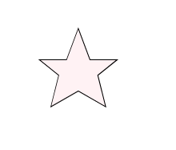

## Play with Elements

Full script to get



```smalltalk
elt := BlElement new
            size: 150 @ 150;
            geometry: (BlPolygonGeometry vertices: {
                            (100 @ 50).
                            (115 @ 90).
                            (150 @ 90).
                            (125 @ 110).
                            (135 @ 150).
                            (100 @ 130).
                            (65 @ 150).
                            (75 @ 110).
                            (50 @ 90).
                            (85 @ 90) });
            background: (Color pink alpha: 0.2);
            border: (BlBorder paint: Color black width: 1).

elt addEventHandlerOn:BlMouseOverEvent do: [ :anEvent |
                anEvent consumed: true.
                elt
                    background: (Color blue alpha: 0.2);
                    border: (BlBorder paint: Color purple width: 1) ].

elt addEventHandlerOn:BlMouseLeaveEvent do: [ :anEvent |
                anEvent consumed: true.
                elt
                    background: (Color pink alpha: 0.2);
                    border: (BlBorder paint: Color black width: 1) ].
    
elt addEventHandlerOn: BlMouseDownEvent do: [ :anEvent |
                anEvent consumed: true.
                self inform: 'Star clicked' ].
elt openInNewSpace.
```

### Element instantiation

```smalltalk
elt := BlElement new
            size: 150 @ 150;
            geometry: (BlPolygonGeometry vertices: {
                            (100 @ 50).
                            (115 @ 90).
                            (150 @ 90).
                            (125 @ 110).
                            (135 @ 150).
                            (100 @ 130).
                            (65 @ 150).
                            (75 @ 110).
                            (50 @ 90).
                            (85 @ 90) });
            background: (Color pink alpha: 0.2);
            border: (BlBorder paint: Color black width: 1).
elt openInNewSpace.
```

### Event reaction

When the mouse goes over the star
```smalltalk
elt addEventHandlerOn:BlMouseOverEvent do: [ :anEvent |
                anEvent consumed: true.
                elt
                    background: (Color blue alpha: 0.2);
                    border: (BlBorder paint: Color purple width: 1) ].
```

When the mouse goes out of the star.
```smalltalk
elt addEventHandlerOn:BlMouseLeaveEvent do: [ :anEvent |
                anEvent consumed: true.
                elt
                    background: (Color pink alpha: 0.2);
                    border: (BlBorder paint: Color black width: 1) ].
```

When we click on the star
```smalltalk

elt addEventHandlerOn: BlMouseDownEvent do: [ :anEvent |
                anEvent consumed: true.
                self inform: 'Star clicked' ].
```

### Nesting elements

### Conclusion