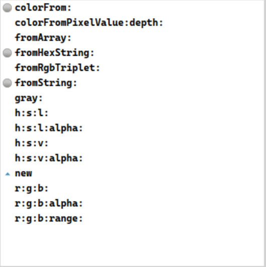
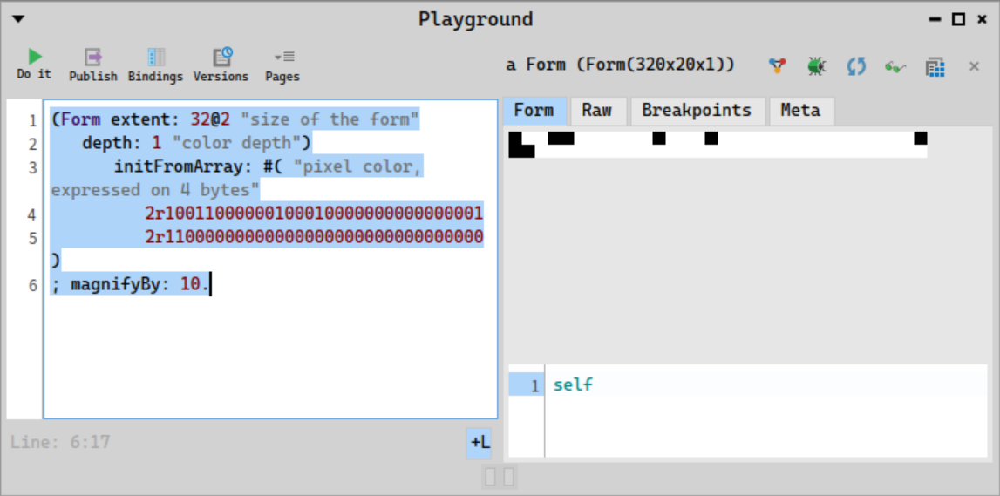
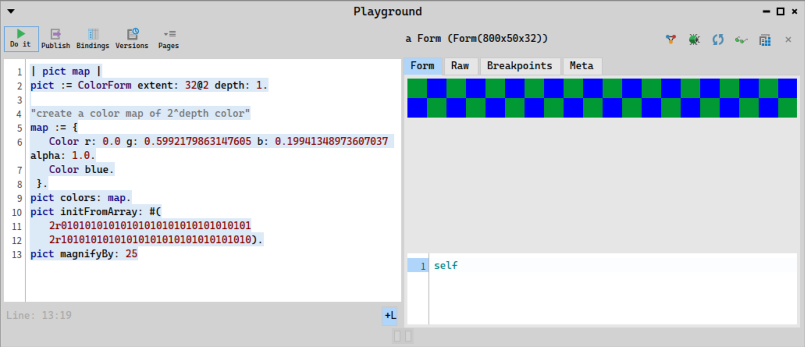
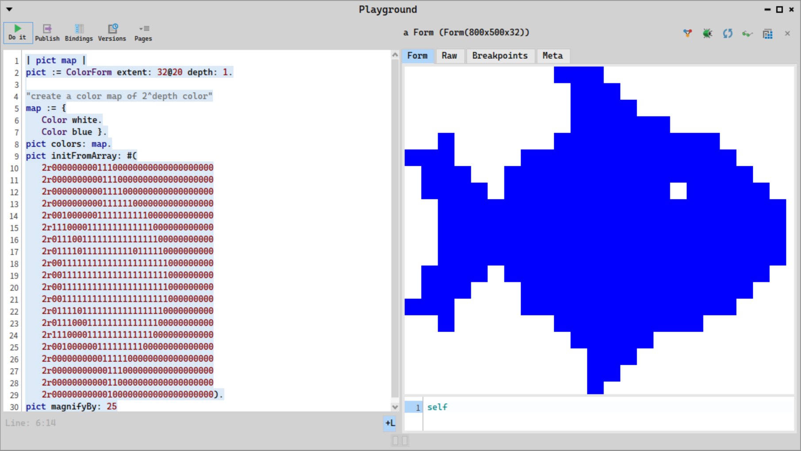
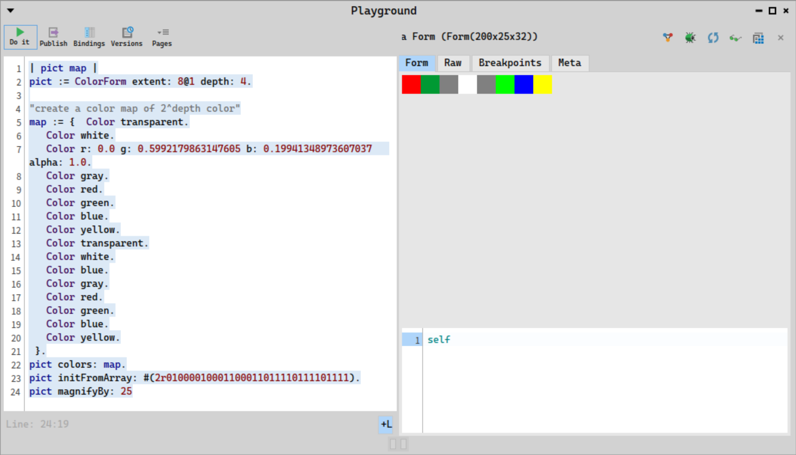
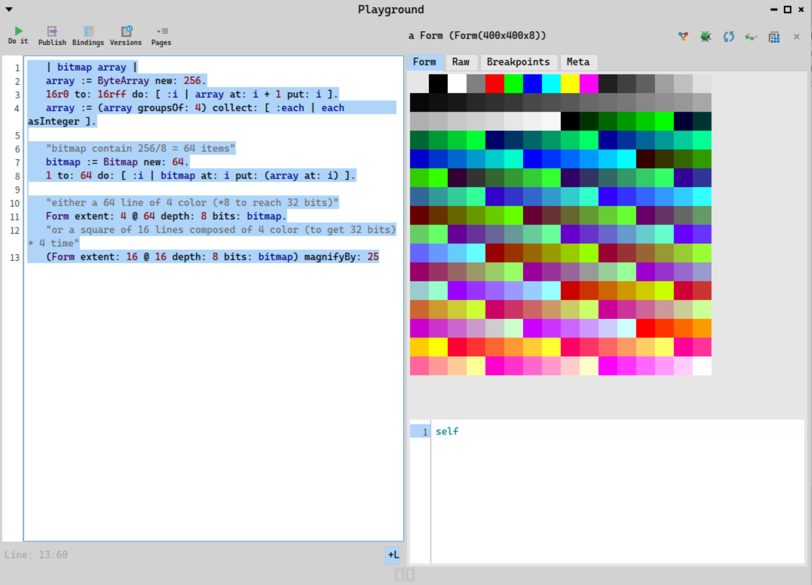
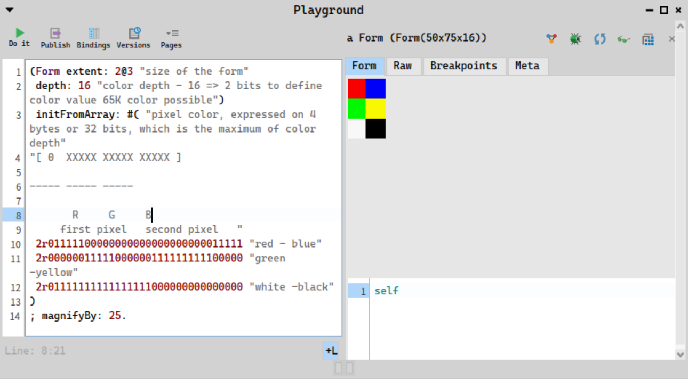
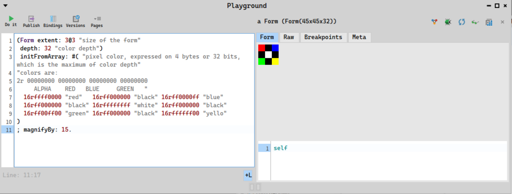

## Color and color depth

The depth of a Form is how many bits are used to specify the color at each pixel.  The supported depths (in bits) are 1, 2, 4, 8, 16, and 32. The color depth is a measure of an individual image pixel to accurately represent a color. Color  depth is calculated in bits-per-pixel or bpp.

For example, 1-bit color depth or 1bpp means a pixel can have a 1-bit color or 2 values. Monochromatic images have 1-bit color depth because a pixel can be true  black or true white.

The number of actual colors at these depths are: 2, 4, 16, 256, 32768, and 16 million. For different color depth, you can store a different number of pixel for each element comprising the array of data.

`|Depth   | number of color  | pixel displayed |`
`|--------|------------------|-----------------|`
`|1       |2^1 = 2           | 32              |`
`|2       |2^2 = 4           | 16              |`
`|4       |2^4 = 16          | 8               |`
`|8       |2^8 = 256         | 4               |`
`|16      |2^16 = 32768      | 2               |`
`|32      |2^32 = 16 millions| 1               |`

The bits representing the bitmap pixels are packed in rows. The size of each row is rounded up to a multiple of 4 bytes (32 bits). The pixel array describes the image pixel by pixel. You can also have an alpha-channel to add transparency in the image using 32-bit color depth.


- The coordinates of a Form start from the top-left corner much like most graphic system out there (why ? Because Western language are mostly written left to right, top to bottom, and initial text display follow this convention, instead of classic Cartesian coordinate). Forms are indexed starting at 0 instead of 1; thus, the top-left pixel of a Form has coordinates 0@0.

The actual bits are held in a Bitmap, whose internal structure is different at each depth. Class Color allows you to deal with colors without knowing how they are actually encoded inside a Bitmap.

You also have indexed color. For each pixel, you have a color index that will provide its true color. This is defined as *ColorForm* is Pharo In the Form, the bitmap is an index to a color map index, which size is **2^depth** color

`ColorForm extent: 32@2 depth: 8` 

- For **24** and **32** bits RBG, there is 8 bits allocated to each color component. In 32 bits, there is an additional alpha channel, to manage transparency. In RGB space any colour is represented as a point inside a colour cube with orthogonal axes r,g,b. Grey values form a straight line from black to white along the diagonal of the cube, r = g = b.

Through the color map, you can access different colors than the default defined in the color depth. Furthermore, Color can be defined with alpha channel.

Class **Color** allows you to deal with colors without knowing how they are actually encoded inside a Bitmap.

### RGB and color definition

#### What is RGB?

In RGB space any color is represented as a point inside a color cube with
orthogonal axes r,g,b. Grey values form a straight line from black to white
along the diagonal of the cube, r = g = b.

```txt
          cyan (0,1,1 ) +------------------------+ White (1,1,1 )
                       /|                       /|
                      /                        / |
                     /  |                     /  |
                    /                        /   |
                   /    |                   /    |
    Blue (0,0,1 ) +------------------------+ Magenta (1,0,1 )
                  |     |                  |     |
                  |                        |     |
                  |     |                  |     |
         Green (0,1,0 ) +- - - - - - - - - |- - -+ yellow (1,1,0 )
                  |    /                   |    /
          `       |                        |   /
                  |  /                     |  /
                  |                        | /
                  |/                       |/
    Black (0,0,0 )+------------------------+ red(1,0,0 )
```

#### What is HSV and HSL?

HSL stand for *hue*, *saturation* and *lightness*.
HSV stand for *hue*, *saturation* and *brightness*.
By convention, brightness is abbreviated 'v' to to avoid
confusion with blue.
It is another way to describe color, and is more
convenient way
to organize differences in colors as perceived by humans.
This is because human perception sees colors in these ways
and not as triplets of numbers.

you can define Color in Pharo, either from RGB, HSL or 
from HSV triplets from `Color` class



### How are the basic colors defined?

You may have noticed that the basic color depth (2, 4, and 8) have a predefined set
of color.

For example, for a depth of 4, you can have 16 different colors.
Picking the color of a specific pixel will give you its name.

```smallalk
(Form extent: 8@2 depth: 4 )
 initFromArray: #(
 2r00000001001000110100010101100111
 2r10001001101010111100110111101111
) ; colorAt: 1@1
```


give **Color Magenta**

The basic colors are initialized in *Color class >> initializeIndexedColors*.
Take a look at it to find the definition of all base colors.

### Color form in Pharo

If you are not happy with the different base colors, you can specify a color palette
that will be used as a replacement. They are called indexed colors. For each pixel,
 you have a color index that will provide its true color. This is defined as *ColorForm* is Pharo
In the Form, the bitmap is an index to a color map index, whose size is

$2^{depth}$ color

```smalltalk
    ColorForm extent: 32@2 depth: 8
```

```txt
    +-+-+-+-+    |index  | red   | green | blue  |
    | | | | |    |-------|-------|-------|-------|
    +-+-+-+-+ -> | 0     |       |       |       |
    | | | | |    | ...   |0 - 255|0 - 255|0 - 255|
    +-+-+-+-+    |2^depth|       |       |       |
```

Through the color map, you can access different colors than the default defined
in the color depth. Furthermore, Color can be defined with an alpha channel.

Class Color allows you to deal with colors without knowing how they
are actually encoded inside a Bitmap.

### Playing with color depth

#### 1-bit depth

You can define the color of 32 pixel with color depth 1 playing with color and form.

```
(Form extent: 32@2 "size of the form"
	depth: 1 "color depth")
		initFromArray: #( "pixel color, expressed on 4 bytes"
			2r10011000000100010000000000000001
			2r11000000000000000000000000000000 )
; magnifyBy: 10.
```


##### Using `Bitmap`:

```smalltalk
 bitMap := Bitmap newFrom: #( "pixel color, expressed on 4 byte"
	2r10011000000100010000000000000001
	2r11000000000000000000000000000000
) .

(Form extent: 32@2 "size of the form"
	depth: 1 "color depth")
	initFromArray: bitMap; 
	magnifyBy: 10.
```


##### using colorForm
- Use `ColorForm` if you want to use color other than black and white:

```
| pict map |
pict := ColorForm extent: 32@2 depth: 1.

"create a color map of 2^depth color"
map := {
	Color r: 0.0 g: 0.5992179863147605 b: 0.19941348973607037 alpha: 1.0.
	Color blue.
 }.
pict colors: map.
pict initFromArray: #(
	2r01010101010101010101010101010101
	2r10101010101010101010101010101010).
pict magnifyBy: 25
```



Our initial fish could be described in blue like:

```
| pict map |
pict := ColorForm extent: 32@20 depth: 1.

"create a color map of 2^depth color"
map := {
	Color white.
	Color lightBlue }.
pict colors: map.
pict initFromArray: #(
	2r00000000011100000000000000000000
	2r00000000001110000000000000000000
	2r00000000001111000000000000000000
	2r00000000001111110000000000000000
	2r00100000011111111110000000000000
	2r11100001111111111111000000000000
	2r01110011111111111111100000000000
	2r01111011111111110111110000000000
	2r00111111111111111111111000000000
	2r00111111111111111111111000000000
	2r00111111111111111111111000000000
	2r00111111111111111111111000000000
	2r01111011111111111111110000000000
	2r01110001111111111111100000000000
	2r11100001111111111111000000000000
	2r00100000011111111100000000000000
	2r00000000001111100000000000000000
	2r00000000000111000000000000000000
	2r00000000000110000000000000000000
	2r00000000000100000000000000000000).
pict magnifyBy: 25
```




This is how the cursor is defined in Morphic World. 
By default, a cursor size can only be 16@16. However, 
because data is stored in 32 bits, we need to add 16
additional bits of white to store it, even if they won't 
be displayed.

```
(Form extent: 16@16
 depth: 1
 fromArray: #(
  2r10000001000000000000000000000000
  2r11000000000000000000000000000000
  2r11100000000000000000000000000000
  2r11110000000000000000000000000000
  2r11111000000000000000000000000000
  2r11111100000000000000000000000000
  2r11111110000000000000000000000000
  2r11111000000000000000000000000000
  2r11111000000000000000000000000000
  2r10011000000000000000000000000000
  2r00001100000000000000000000000000
  2r00001100000000000000000000000000
  2r00000110000000000000000000000000
  2r00000110000000000000000000000000
  2r00000011000000000000000000000000
  2r00000011000000000000000000000000)
 offset: 0@0) magnifyBy: 10.
```


#### 2-bit depth with color Form

```
(Form extent: 16@1 "size of the form"
	depth: 2 "color depth - 16 => 2 bits to define color value")
	 initFromArray: #( "pixel color, expressed on 4 bytes or 32 bits, which is the maximum of color depth"
"[ 0000 0000 0000 0000 0000 0000 0000 0000]
 first second third fourth pixel
  Each pixel can have 2^2 = 4 different color"
"[ 0000 0000 0000 0000 0000 0000 0000 0000]"
 2r00011011000110110001101100011011 "4 colors"
	); magnifyBy: 25.
```


With ColorForm:

```smalltalk
| pict map |
pict := ColorForm extent: 16@1 depth: 2.

"create a color map of 2^depth color"
map := {  
	Color white. 
	Color r: 0.0 g: 0.5992179863147605 b: 0.19941348973607037 alpha: 1.0.
	Color blue.
	Color red.
}.
pict colors: map.
pict initFromArray: #(2r00011011000110110001101100011011).
pict magnifyBy: 25
```


#### 4bit depth with color Form

You can define the color of 8 pixel with color depth 16

```smalltalk
(Form extent: 8@2 "size of the form"
 depth: 4 "color depth - 16 => 2 bits to define color value")
 initFromArray: #( "pixel color, expressed on 4 bytes or 32 bits, which is the maximum of color depth"
"[ 0000 0000 0000 0000 0000 0000 0000 0000]
 first   second    third    fourth pixel
  Each pixel can have 2^4 = 16 different color"
"[ 0000 0000 0000 0000 0000 0000 0000 0000]"
 2r00000001001000110100010101100111 "8 colors"
 2r10001001101010111100110111101111 "8 colors"
)
; magnifyBy: 25.
```


With ColorForm:

```smalltalk
| pict map |
pict := ColorForm extent: 8@1 depth: 4.

"create a color map of 2^depth color"
map := {  Color transparent.
   Color white.
   Color r: 0.0 g: 0.5992179863147605 b: 0.19941348973607037 alpha: 1.0.
   Color gray.
   Color red.
   Color green.
   Color blue.
   Color yellow.
   Color transparent.
   Color white.
   Color blue.
   Color gray.
   Color red.
   Color green.
   Color blue.
   Color yellow.
 }.
pict colors: map.
pict initFromArray: #(2r01000010001100011011110111101111).
pict magnifyBy: 25
```



#### 8bit depth

You can define the color of 4 pixel with color depth 8

```smalltalk
| bitmap array |
array := ByteArray new: 256.
16r0 to: 16rff do: [ :i | array at: i + 1 put: i ].
array := (array groupsOf: 4) collect: [ :each | each asInteger ].

"bitmap contain 256/8 = 64 items"
bitmap := Bitmap new: 64.
1 to: 64 do: [ :i | bitmap at: i put: (array at: i) ].

"either a 64 line of 4 color (*8 to reach 32 bits)"
Form extent: 4 @ 64 depth: 8 bits: bitmap.
"or a square of 16 lines composed of 4 color (to get 32 bits) * 4 time"
(Form extent: 16 @ 16 depth: 8 bits: bitmap) magnifyBy: 25
```



Using ColorForm to reverse the color:

```smalltalk
| pict map array |

array := ByteArray new: 256.
16r0 to: 16rff do: [ :i | array at: i + 1 put: i ].

"create a color map of 2^depth color"
map := (Color indexedColors copy) reverse .
map at: 1 put: Color transparent.

pict := (ColorForm extent: 16@16 depth: 8) initFromArray:
		((array groupsOf: 4) collect: [ :each | each asInteger ]);
		colors: map; magnifyBy: 25
```


##### 16 bit depth
You can define the color of 2 pixel with color depth 16

```
(Form extent: 2@3 "size of the form"
 depth: 16 "color depth - 16 => 2 bits to define color value 65K color possible")
 initFromArray: #( "pixel color, expressed on 4 bytes or 32 bits, which is the maximum of color depth"
"[ 0  XXXXX XXXXX XXXXX ]

----- ----- -----

       R     G     B
     first pixel   second pixel   "
 2r01111100000000000000000000011111 "red - blue"
 2r00000011111000000111111111100000 "green -yellow"
 2r01111111111111111000000000000000 "white -black"
)
; magnifyBy: 25.
```


### 32 bits depths

```
(Form extent: 7@1 "size of the form"
 depth: 32 "color depth")
 initFromArray: #( "pixel color, expressed on 4 bytes or 32 bits, which is the maximum of color depth"
"colore are:
2r 00000000 00000000 00000000 00000000
     ALPHA    RED   BLUE     GREEN   "
  16rffff0000 "red"
  16rff0000ff "blue"
  16rff00ff00 "green"
  16rff000000 "black"
  16rffffffff "white"
  16rf0ff00d9 "pink"
  16r2fff0000 "red with opacity"
)
; magnifyBy: 25.
```


Data is stored in Byte - remember that 8 bits = 1 bytes. Each entry of the color palette takes 4 bytes to define a color

```
(Form extent: 3@3 "size of the form"
 depth: 32 "color depth")
 initFromArray: #( "pixel color, expressed on 4 bytes or 32 bits, which is the maximum of color depth"
"colors are:
2r 00000000 00000000 00000000 00000000
     ALPHA    RED   BLUE     GREEN   "
  16rffff0000 "red"   16rff000000 "black" 16rff0000ff "blue"
  16rff000000 "black" 16rffffffff "white" 16rff000000 "black"
  16rff00ff00 "green" 16rff000000 "black" 16rffffff00 "yello"
)
; magnifyBy: 15.
```


