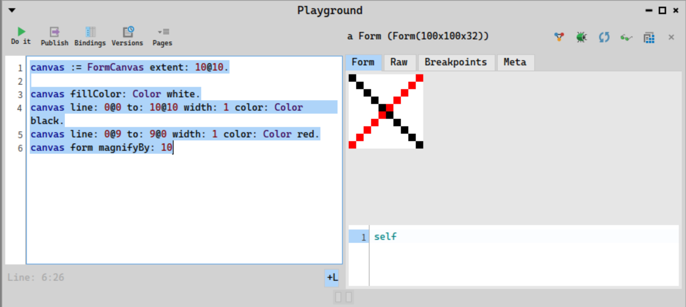
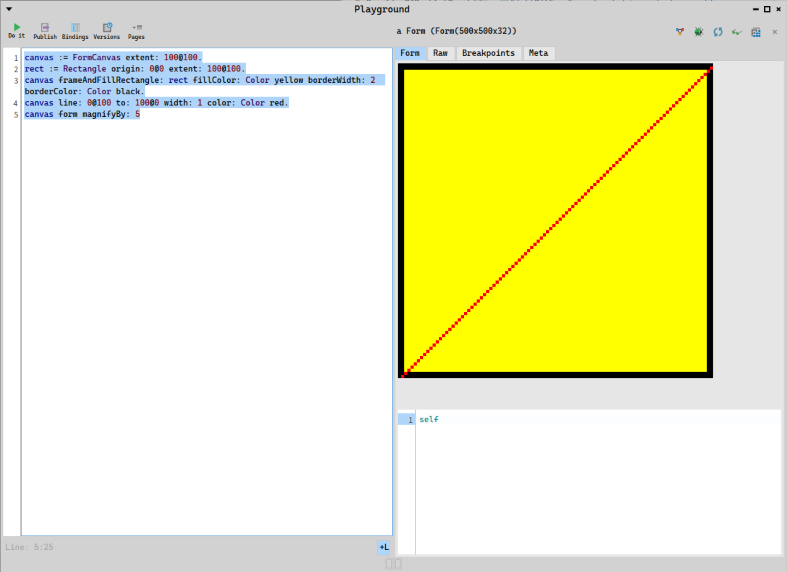
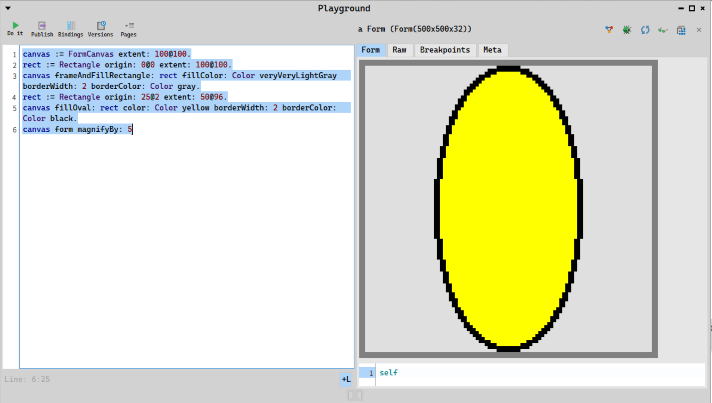

## Drawing with bitmap canvas

One can manage the Form pixel by pixel. However, you would quickly start to implement primitive to help draw lines, circles, ellipses, and border, and fill the geometric mesh you would have just created.

Don't look any further, the problem has already been solved, with the Canvas object. In Pharo, it's more specifically a FormCanvas object, a Canvas that interacts well  with a Form

Here is the definition of Canvas from Pharo documentation:
"*A canvas is a two-dimensional medium on which morphs are drawn in a device-independent manner. Canvases keep track of the origin and clipping rectangle, as well as the underlying drawing medium (such as a window, pixmap, or postscript script).*"

### Creating a canvas

```smalltalk
canvas := FormCanvas extent: 10@10.

canvas fillColor: Color white.
canvas line: 0@0 to: 10@10 width: 1 color: Color black.
canvas line: 0@9 to: 9@0 width: 1 color: Color red.
canvas form magnifyBy: 10
```



## Canvas with specific depth

bitPatternForDepth: depth
 "Return a Bitmap, possibly containing a stipple pattern, that best represents this color at the given depth. BitBlt calls this method to convert colors into Bitmaps. The resulting Bitmap may be multiple words to represent a stipple pattern of several lines.  "
 "See also: pixelValueAtDepth: -- value for single pixel
    pixelWordAtDepth: -- a 32-bit word filled with the pixel value"
 "Details: The pattern for the most recently requested depth is cached."
 "Note for depths > 2, there are stippled and non-stippled versions (generated with #balancedPatternForDepth: and #bitPatternForDepth:, respectively). The stippled versions don't work with the window bit caching of StandardSystemView, so we make sure that for these depths, only unstippled patterns are returned"

```smalltalk
canvas := FormCanvas extent: 10@10 depth: 4.

canvas fillColor: Color white.
canvas line: 0@0 to: 10@10 width: 1 color: Color black.
canvas line: 0@9 to: 9@0 width: 1 color: (Color r: 0.5 g: 0.5 b: 0.5).
canvas form magnifyBy: 10
```

```smalltalk
pict := ColorForm extent: 10@10 depth: 2.

"create a color map of 2^depth color"
map := {  Color lightBlue .
   Color blue .
   Color lightGray .
   Color red.
 }.
pict colors: map.

canvas := FormCanvas on: pict.

"canvas fillColor: (Color fromHexString:'100000')."
canvas line: 0@0 to: 10@10 width: 1 color: Color lightCyan .
canvas line: 0@9 to: 9@0 width: 1 color: Color blue.
canvas line: 0@5 to: 10@5 width: 1 color: Color white.
canvas line: 5@0 to: 5@10 width: 1 color: Color yellow.
canvas line: 0@9 to: 9@0 width: 1 color: Color red.
canvas form magnifyBy: 10.
```


### Canvas examples

#### Playing with rectangle and lines

```smalltalk
canvas := FormCanvas extent: 100@100.
rect := Rectangle origin: 0@0 extent: 100@100.
canvas frameAndFillRectangle: rect fillColor: Color yellow borderWidth: 2 borderColor: Color black.
canvas line: 0@100 to: 100@0 width: 1 color: Color red.
canvas form magnifyBy: 5
```




#### Playing with text.

```smalltalk
canvas := FormCanvas extent: 200@50.
rect := Rectangle origin: 0@0 extent: 200@50.
canvas frameAndFillRectangle: rect fillColor: Color veryVeryLightGray borderWidth: 2 borderColor: Color black.
canvas drawString: 'hello from Pharo Canvas in World' from: 1 to: 32 in: (Rectangle origin: 10@0 extent: 200@50) font: nil color:Color red underline: true underlineColor: Color orange strikethrough: true strikethroughColor: Color orange.
canvas form magnifyBy: 5
```


#### Playing with circles and ovals.

```smalltalk
canvas := FormCanvas extent: 100@100.
rect := Rectangle origin: 0@0 extent: 100@100.
canvas fillOval: rect color: Color yellow borderWidth: 2 borderColor: Color black.
canvas form magnifyBy: 5
```

```smalltalk
canvas := FormCanvas extent: 100@100.
rect := Rectangle origin: 0@0 extent: 100@100.
canvas frameAndFillRectangle: rect fillColor: Color veryVeryLightGray borderWidth: 2 borderColor: Color gray.
rect := Rectangle origin: 25@2 extent: 50@96.
canvas fillOval: rect color: Color yellow borderWidth: 2 borderColor: Color black.
canvas form magnifyBy: 5
```



#### Playing with polygons.

```smalltalk
canvas := FormCanvas extent: 100@100.
rect := Rectangle origin: 0@0 extent: 100@100.
canvas drawPolygon: {25@0 . 75@0 . 100@25 . 100@75 . 75@100 . 25@100 . 0@75. 0@25} color: Color yellow borderWidth: 2 borderColor: Color black.
canvas form magnifyBy: 5.
```

```smalltalk
canvas := FormCanvas extent: 100@100.
rect := Rectangle origin: 0@0 extent: 100@100.
fill := GradientFillStyle ramp: {0.0 -> Color white. 1.0 -> Color black}.
 fill origin: 0@0.
 fill direction: 100@100.
 fill normal: 0@100 .
 fill radial: true.
canvas drawPolygon: {25@0 . 75@0 . 100@25 . 100@75 . 75@100 . 25@100 . 0@75. 0@25} fillStyle: fill borderWidth: 2 borderColor: Color red.
canvas form magnifyBy: 5.
```


### Bitmap and Form references

- [Little Library built on top of Form](https://github.com/pablo1n7/ImageForm)
- Reference: http://paulbourke.net/dataformats/bitmaps/
- [color](https://manifold.net/doc/mfd8/colors_as_hue_saturation_and_brightness.htm)