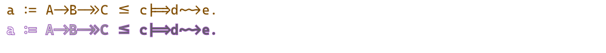

# text, font, unicode and harfbuzz

Text shaping is the process of translating a string of character codes
(such as Unicode codepoints) into a properly arranged sequence of glyphs
that can be rendered onto a screen or into final output form for inclusion
in a document. The shaping process is dependent on the input string, the active
font, the script (or writing system) that the string is in, and the language
that the string is in.

Text rendering involve 3 different library that needs to work together:

- Freetype, which provide the collection of representation for different characters.
- Harfbuffer, which will provide shaped glyphs for text provided, according to selected font
- Cairo context which will render glyphs.

This part will not look at the Cairo/Alexandrie "toy" text API, but will only
focus on the full text rendering API.

## Quick reminder on Unicode - distinction between point, grapheme and ligature

Unicode is a standard that aims to unify all human languages and make them work
with computers. In practice, Unicode is a table that assigns unique numbers
to different characters. Unicode refers to these numbers as code points. A code
point is not a unit of writing; one code point is not always a single character.

*U+1F4A9* is convention for how to write code point values. The prefix U+ means,
well, Unicode, and 1F4A9 is a code point number in hexadecimal.

A grapheme is a minimally distinctive unit of writing in the context of a
particular writing system. ö is one grapheme. é is one too. Basically, grapheme
is what the user thinks of as a single character. In Unicode, some graphemes are
encoded with multiple code points. For example, é (a single grapheme) is encoded
in Unicode as e (U+0065 Latin Small Letter E) + ´ (U+0301 Combining Acute Accent).
Two code points!

[more information on unicode](https://tonsky.me/blog/unicode/)

In writing and typography, a ligature occurs where two or more graphemes
are joined to form a single glyph. Examples are the characters ⟨æ⟩ and ⟨œ⟩ used
in English and French, in which the letters ⟨a⟩ and ⟨e⟩ are joined for the
first ligature and the letters ⟨o⟩ and ⟨e⟩ are joined for the second ligature.

Font can include information on ligature, which then need to be rendered by
the underlying engine. For Example, [Casdadia Code](https://github.com/microsoft/cascadia-code)
include font ligature or arrow support.


## freetype, harfbuzz and Alexandrie

FreeType is a software library to render fonts. It is a very low-level rendering
engine. All it knows how to do is render individual glyphs and return metrics
for them. HarfBuzz allows programs to convert a sequence of Unicode input into
properl formatted and positioned glyph. HarfBuzz selects and positions the
corresponding glyphs from the font, applying all of the necessary layout rules
and font features.

Used together, HarfBuzz can perform shaping on Unicode text segments, outputting
the glyph IDs that FreeType should rasterize from the active font as well as
the positions at which those glyphs should be drawn. HarfBuzz returns the
rendered result to you in the form that Alexandrie can use to display it. If
you don't need advanced shaping feature, Pharo can use the primitive directly
available in the Cairo library

Alexandrie then do the rendering of the glyphs on surface destination. You can
choose to use Harfbuzz or not. You can somehow view Glyphs as a vectorial
representation of the characters you want to display. Being vectorial, you have
2 API available:

- **showGlyphs:** Generate the shape of glyphs directly.
- **appendGlyphsPath:** Append to context path, giving you the option to customize fill and stroke color rendering.

Below is an example of the same string. The first one is rendered directly with
Cairo, and the second is processed by Harfbuzz.


Now, let's go to the fun phase, and how you can effectively render text in Pharo.

## font selection

Font selection and setup is one in 3 steps

1. Select a font library and the face of the font
2. Specify font options
3. Scale font to desired display size, and make Cairo context aware of it.

### FreeType font selection

Before specifying your font, you must select it. SourceCodePro is embedded by
default in Pharo. You can also select font on your system if you whish, or
include them in your apps for more portability.
`AeFontManager globalInstance familyNames.` will give you all font available on
in your image.

To select your specific font face, you'll need the family font name and font
properties like **slant** or **style**, **weight** and **stretch**

- font **slant** or style (*italic*, *normal*, *oblique*)
- font **weight** (*Thin*, *ExtraLight*, *Light*, *SemiLight*, *Normal*, *Medium*, *SemiBold*, *Bold*, *ExtraBold*, *Black*, *ExtraBlack*)
- font **stretch** (*UltraCondensed*, *ExtraCondensed*, *Condensed*, *SemiCondensed*, *Normal*, *SemiExpanded*, *Expanded*, *ExtraExpanded*, *UltraExpanded*)

This will get *Cambria Math* face.

```smalltalk
|aManager aFace|
aManager := AeFontManager globalInstance.
aManager scanDefaultDirectories.

aFace := aManager
         detectFamilyName: 'Cambria Math'
         slant: AeFontSlant normal 
         weight: AeFontWeight normal 
         stretch: AeFontStretch normal
         ifNone: [ self inform: 'missing font' ].
aFace
```

### Alexandrie font option

Font option tells how fonts should be rendered. Most of the time the font
options implied by a surface are just right and do not need any changes,
but for pixel-based targets tweaking font options may result in superior
output on a particular display.

```smalltalk
fontOptions := AeCairoFontOptions new
                    antialias: AeCairoAntialias fast;
                    hintMetrics: AeCairoHintMetrics on;
                    hintStyle: AeCairoHintStyle slight;
                    subpixelOrder: AeCairoSubpixelOrder default.
```

### Context font size

It represents a realization of a font face at a particular size and
transformation and a certain set of font options.

A scaled font is created with:

- **fontFace:** a AeCairoFontFace which represents a particular font at a particular weight, slant.
- **fontMatrix:** font space to user space transformation matrix for the font. In the simplest case of a N point font, this matrix is just a scale by N, but it can also be used to shear the font or stretch it unequally along the two axes.
- **userToDeviceMatrix:** a transformation matrix with which the font will be used.
- **options:** a AeCairoFontOptions to use when getting metrics for the font and rendering with it.

You then tell your context about your scale font:

```smalltalk
scaledFont := AeCairoScaledFont
                    fontFace:
                    (AeCairoFreetypeFontFace newForFace: freetypeFace)
                    fontMatrix:
                    (AeCairoMatrix newScalingByX: fontHeight y: fontHeight)
                    userToDeviceMatrix: AeCairoMatrix newIdentity
                    options: fontOptions.
context scaledFont: scaledFont.
```

### text display with Harfbuzz

If you want to render your text with Harfbuzz, you'll have to create a Harfbuzz
buffer with text and description of text option. This can be independent of
font specification. You can skip this if you want to use Cairo directly.

```smalltalk
buffer := AeHbBuffer new
            direction: AeHbDirection leftToRight;
            script: AeHbScript latin;
            language: AeHbLanguage en;
            clusterLevel: AeHbBufferClusterLevel recommended;
            flags: AeHbBufferFlags beginningOrEndingOfText;
            addString: text.
```

You can then add the generated glyphs to your context

```smalltalk
context showGlyphs: (buffer cairoGlyphArrayForFace: freetypeFace size: fontHeight).
```

or

```smalltalk
    appendGlyphsPath: (buffer cairoGlyphArrayForFace: freetypeFace size: fontHeight);
    sourceColor: (Color blue   alpha: 0.7);
    strokePreserve;
    source: (AeCairoLinearGradientPattern
                from: 0 @ 0
                to: 100 @ 100
                addStopsFrom: {
                        (0 -> Color white).
                        (1 -> Color darkGray ) });
```

### text display directly with Cairo

If you don't want to use Harfbuzz, you can ask Alexandrie to render your text
using the bare Cairo API

```smalltalk
context showGlyphs: (scaledFont glyphArrayForString: text).
```

or

```smalltalk
    appendGlyphsPath: (scaledFont glyphArrayForString: text);
    sourceColor: (Color blue   alpha: 0.7);
    strokePreserve;
    source: (AeCairoLinearGradientPattern
                from: 0 @ 0
                to: 100 @ 100
                addStopsFrom: {
                        (0 -> Color white).
                        (1 -> Color darkGray ) });
```

## full example

First example without Harfbuzz

```smalltalk
| surface context scaledFont fontHeight fontManager freetypeFace fontOptions text fontLibrary  buffer glyphs|
text := 'a := A->B->>C <= c|=>d~~>e.'.
fontHeight := 22.

surface := AeCairoImageSurface
                extent: 1000 @ (fontHeight * 4)
                format: AeCairoSurfaceFormat argb32.
context := surface newContext.

context
    sourceColor: Color white;
    paint.

fontManager := AeFontManager globalInstance.
fontManager scanDirectory: AeFilesystemResources fontsDirectory;
scanEmbeddedFonts.
freetypeFace := fontManager
         detectFamilyName: 'Cascadia Code'
         slant: AeFontSlant normal
         weight: AeFontWeight normal
         stretch: AeFontStretch normal
         ifNone: [ self inform: 'missing font' ].

fontOptions := AeCairoFontOptions new
                    antialias: AeCairoAntialias fast;
                    hintMetrics: AeCairoHintMetrics on;
                    hintStyle: AeCairoHintStyle slight;
                    subpixelOrder: AeCairoSubpixelOrder default.

scaledFont := AeCairoScaledFont
                    fontFace:
                    (AeCairoFreetypeFontFace newForFace: freetypeFace)
                    fontMatrix:
                    (AeCairoMatrix newScalingByX: fontHeight y: fontHeight)
                    userToDeviceMatrix: AeCairoMatrix newIdentity
                    options: fontOptions.
context scaledFont: scaledFont.
"Margin"
context translateBy: fontHeight / 2 @ 0.

"full stroke and fill paint"
context translateBy: 0 @ (fontHeight * 1.1);
    sourceColor: Color red muchDarker;
    showGlyphs: (scaledFont glyphArrayForString: text).

"different paint between fill and stroke"
context
    translateBy: 0 @ (fontHeight * 1.5);
    appendGlyphsPath: (scaledFont glyphArrayForString: text);
    sourceColor: (Color blue   alpha: 0.7);
    strokePreserve;
    source: (AeCairoLinearGradientPattern
                from: 0 @ 0
                to: 100 @ 100
                addStopsFrom: {
                        (0 -> Color white).
                        (1 -> Color darkGray ) });
    fill.

^ surface asForm
```


Same example, with Harfbuzz this time

```smalltalk
| surface context scaledFont fontHeight fontManager freetypeFace fontOptions text fontLibrary  buffer glyphs|
text := 'a := A->B->>C <= c|=>d~~>e.'.
fontHeight := 22.

surface := AeCairoImageSurface
                extent: 1000 @ (fontHeight * 4)
                format: AeCairoSurfaceFormat argb32.
context := surface newContext.

context
    sourceColor: Color white;
    paint.

fontManager := AeFontManager globalInstance.
fontManager scanDirectory: AeFilesystemResources fontsDirectory;
scanEmbeddedFonts.
freetypeFace := fontManager
         detectFamilyName: 'Cascadia Code'
         slant: AeFontSlant normal
         weight: AeFontWeight normal
         stretch: AeFontStretch normal
         ifNone: [ self inform: 'missing font' ].

fontOptions := AeCairoFontOptions new
                    antialias: AeCairoAntialias fast;
                    hintMetrics: AeCairoHintMetrics on;
                    hintStyle: AeCairoHintStyle slight;
                    subpixelOrder: AeCairoSubpixelOrder default.

scaledFont := AeCairoScaledFont
                    fontFace:
                    (AeCairoFreetypeFontFace newForFace: freetypeFace)
                    fontMatrix:
                    (AeCairoMatrix newScalingByX: fontHeight y: fontHeight)
                    userToDeviceMatrix: AeCairoMatrix newIdentity
                    options: fontOptions.
context scaledFont: scaledFont.
"Margin"
context translateBy: fontHeight / 2 @ 0.

buffer := AeHbBuffer new
                    direction: AeHbDirection leftToRight;
                    script: AeHbScript latin;
                    language: AeHbLanguage en;
                    clusterLevel: AeHbBufferClusterLevel recommended;
                    flags: AeHbBufferFlags beginningOrEndingOfText;
                    addString: text.

glyphs := buffer
                    cairoGlyphArrayForFace: freetypeFace
                    size: fontHeight.

"full stroke and fill paint"
context translateBy: 0 @ (fontHeight * 1.1);
    sourceColor: Color orange muchDarker;
    showGlyphs: glyphs.

"different paint between fill and stroke"
context
    translateBy: 0 @ (fontHeight * 1.5);
    appendGlyphsPath: glyphs;
    sourceColor: (Color purple   alpha: 0.7);
    strokePreserve;
    source: (AeCairoLinearGradientPattern
                from: 0 @ 0
                to: 100 @ 100
                addStopsFrom: {
                        (0 -> Color white).
                        (1 -> Color darkGray ) });
    fill.

^ surface asForm
```


