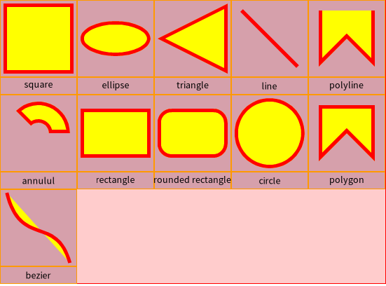
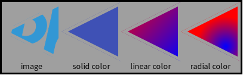

## Bloc & BlElement

### Introduction

**Bloc** is a powerful and innovative graphical framework designed specifically
for Pharo. Initially developed by Alain Plantec, it has received large and valuable
contributions from the Feenk team for **GToolkit** integration. These combined
efforts are now being merged back into **Pharo**, paving the way for a
significant step forward in its graphical capabilities.

### Evolution beyond Morphic

**Bloc** is poised to become the primary graphical framework for Pharo,
gradually replacing the well-established but aging Morphic framework. This
transition promises to bring numerous advantages, including:

* Enhanced performance and efficiency
* Greater flexibility and customization options
* Modernized development experience
* Improved compatibility with various platforms and technologies


### Installation
To install it in Pharo 11, simply type in the playground

```smalltalk
EpMonitor disableDuring: [
  Author useAuthor: 'Load' during: [
    [ Metacello new baseline: 'Toplo'; repository: 'github://pharo-graphics/Toplo:master/src';
        onConflictUseIncoming;
        ignoreImage;
        load.
    ] on: MCMergeOrLoadWarning do: [ :warning | warning load ].
  ].
]
```

**Bloc** distinguishes itself by prioritizing object composition over
inheritance as its core design principle. This means that instead of relying
heavily on complex inheritance hierarchies, **Bloc** encourages building user
interface components by combining and customizing basic building blocks.

Note that Toplo is a new skinnable widget library built on top of Bloc.

### BlElement: The foundation of Bloc components

Every visual element within **Bloc** stems from the fundamental class
`BlElement`. This versatile class serves as the foundation upon which you can
construct more intricate components. By directly customizing and combining
`BlElement` instances, you gain granular control over the appearance and
behavior of your UI elements.

#### Navigating Bloc's spatial landscape

**Bloc** introduces two key concepts for managing the visual environment:
`BlUniverse` and `BlSpace`. Imagine `BlUniverse` as a container housing a
collection of individual `BlSpace` instances. Each `BlSpace` represents a
distinct operating system window where your Pharo application unfolds. If you
have multiple windows open simultaneously, they'll be neatly organized within
the `BlUniverse`, providing a clear overview of your active spaces.

#### Ready to Build: Creating Your First Bloc Component

```smalltalk
BlElement new
	geometry: BlRectangleGeometry  new;
	size: 200 @ 100;
	background: Color blue;
	openInNewSpace
```


1. **Start with a blank canvas:** Begin by creating a new `BlElement`. This serves
as the foundation for your user interface element, initially appearing
invisible.
1. **Define its shape:** In Bloc, the element's visual representation is
determined by its geometry. In this example, we'll use a simple rectangle, but
more complex shapes are also possible (explored in further detail later).
1. **Set its dimensions and appearance:** Specify the element's size and color
to customize its visual characteristics.
1. **Bring it to life:** Finally, open the element in a new space, making it
visible on the screen.


### Geometry of BlElement

In Bloc, the visual form and boundaries of your UI elements are determined by
their geometries. Each element can only possess a single geometry, essentially
acting as a blueprint for its shape and size. You can visualize an element as a
specific geometry encapsulated within an invisible rectangular container,
representing its overall *bounds*.

Bloc provides a diverse range of pre-defined geometry shapes accessible through
`BlElementGeometry allSubclasses`. This comprehensive library empowers you to
construct elements of varying complexities, from basic rectangles and circles to
more intricate forms.

Bloc excels in facilitating the creation of custom components with advanced
layout possibilities. Imagine building complex layouts by strategically
arranging various elements, each defined by its unique geometry, to form a
cohesive whole.

While the Alexandrie canvas provides a foundational set of building drawing
primitives, Bloc offers a richer library of pre-defined shapes and the
flexibility to construct even more intricate geometries.



* **Annulus** : `BlAnnulusSectorGeometry new startAngle: 225; endAngle: 360;   innerRadius: 0.3; outerRadius: 0.9);`
* **bezier** : `BlBezierCurveGeometry controlPoints: { 5@0. 25@80. 75@30. 95@100 }`
* **circle** : `BlCircleGeometry new matchExtent: 100 @ 50`
* **ellipse** : `BlEllipseGeometry new matchExtent: 100 @ 50)`
* **line** : `BlLineGeometry from: 10@10 to: 90@90`
* **Polygon** : `BlPolygonGeometry vertices: {(10 @ 10). (10 @ 90). (50 @ 50). (90 @ 90). (90 @ 10)}`
* **Polyline**: `BlPolylineGeometry vertices: {(10 @ 10). (10 @ 90). (50 @ 50).(90 @ 90). (90 @ 10) }`
* **Rectangle** : `BlRectangleGeometry  new`
* **Rounded rectangle** : `BlRoundedRectangleGeometry cornerRadius: 20`
* **square** : `BlSquareGeometry new matchExtent: 70 @ 70`
* **triangle** : `BlTriangleGeometry new matchExtent: 50 @ 100; beLeft`

### Element border

The geometry is like an invisible line on which your border is painted. The
painting is a subclass of `BlPaint`, and one of the three:

* solid color
* linear gradient color
* radial gradient color


Your border opacity can be specified as well: `opacity: 0.5;`

By default, your border will be a full line, but it can also be dashed, with
**dash array** and **dash offset**. Dash arrays define the number of element, and
dash offset, the space between elements.

You also have a pre-defined option, available in a single call:

* **dashed**
* **dashed small**


If the path is not closed, The style extent of your border can be defined with

* **cap square**
* **cap round**
* **cap butt**

Last, when the line of your border cross each other, you can define the style of
the join:

* **round join**
* **bevel join**
* **mitter join**


You have two option to define your border:

* short call : `border: (BlBorder paint: Color orange width: 5)`
* with a builder :`BlBorder builder dashed; paint: Color red; width: 3; build`

The first one is very helpfull for solid line definition. The builder let use
customize all the detail of your border.

### elements bounds and outskirts

Lets look at the diffent possible bounds of your element.

**Layout bounds** can be defined explicitly using **size:** method or dynamicaly
Layout bounds are considered by layout algorithms to define mutual locations
for all considered elements. You'll know more about layout later.

**Geometry bounds** area is defined by minimum and maximum values of polygon
vertices. This does not take in account the border width

**Visual bounds** is an exact area occupied by an element. it takes strokes
and rendering into account.

The geometry is like a an invisible line on which your border is represented.
The border drawing can happen outside (adding its border size to the size of
your element), centered, or inside the geometry of the element. The final size
(geometry + border width) will define the **bounds** of your element.

In this figure, the same exact star is drawned 3 time. The only difference is
the outskirts definition between those 3.


If we specify BlOutskirts inside, visual bound and geometry bounds will be the
same. But if BlOutskirts is outside, then visual bounds are larger than
geometry bounds to take border width into its calculation.

### element background

quick set-up: `background: (Color red alpha: 0.8);`

using rgb color

```smalltalk
background: (Color r: 63 g: 81           b: 181     range: 255);
```

using linear gradient

```smalltalk
background: ((BlLinearGradientPaint direction: 1 @ 1) from: Color red to: Color blue).
```

using radial gradient

```smalltalk
background: (BlRadialGradientPaint new
stops: { 0 -> Color blue. 1 -> Color red };
center: largeExtent // 2;
radius: largeExtent min;
yourself);
```

Using dedicated *BlPaintBackground* object.

```smalltalk
background: ((BlPaintBackground paint: fillColor asBlPaint) opacity: 0.75; yourself);
```



### Element effect

`BlElementEffect allSubclasses`

```smalltalk
BlElement new
        size: 200 @ 100;
        geometry: (BlRoundedRectangleGeometry cornerRadius: 2);
        background: (Color red alpha: 0.2);
        border: (BlBorder paint: Color yellow width: 1);
        outskirts: BlOutskirts centered;
        effect:
            (BlSimpleShadowEffect color: Color orange offset: -10 @ -20)
```


```
effect: (BlSimpleShadowEffect
	color: (Color orange alpha: shadowAlpha)
	offset: shadowOffset);
```


```smalltalk
BlElement new
        size: 300 @ 150;
        geometry: (BlRoundedRectangleGeometry cornerRadius: 2);
        background: (Color blue alpha: 0.5);
        border: (BlBorder paint: Color red width: 10);
        effect: (BlGaussianShadowEffect color: Color yellow offset: 10@20 width: 5)
```


### Element opacity

The element opacity is a value between 0 and 1, 0 meaning completely transparent.
You can apply opacity to a background, a border, or to your whole element.


### Element transformation

You can apply transformations to a `BlElement`:

* rotation
* translation
* scaling
* reflection
* etc...

```
element transformDo: [ :b | b scaleBy: 0.2; translateBy: -25 @ -15 ];
```


```smalltalk
aContainer := BlElement new
                    layout: BlFrameLayout new;
                    constraintsDo: [ :c |
                        c horizontal fitContent.
                        c vertical fitContent ];
                    padding: (BlInsets all: 20);
                    background: (Color gray alpha: 0.2).

node := BlElement new
            geometry: (BlRoundedRectangleGeometry cornerRadius: 4);
            border: (BlBorder paint: Color black width: 2);
            background: Color white;
            constraintsDo: [ :c |
                c frame horizontal alignCenter.
                c frame vertical alignBottom ];
            size: 20 @ 20.

aContainer transformDo: [ :t |
    t
        scaleBy: 2.0;
        rotateBy: 69;
        translateBy: 50 @ 50 ].
aContainer addChild: node.

aContainer forceLayout.
```


#### Transform catches

The message `transformDo:` can be applied at any moment during the life of an object.
You can use any static or pre-compute properties with `transformDo:` as in the following snippet.
Here ` -25 asPoint` does not depend on the child or parent size.

```
| child parent |
child := BlElement new 
background: Color lightBlue; 
geometry: BlCircleGeometry new;
yourself.
 
child position: 100@100.
child  transformDo: [ :t | t translateBy: -25 asPoint ].

parent := BlElement new 
size: 200 asPoint; 
addChild: child;
background: Color lightRed.

parent openInSpace.
```

**Important.**
if you want to use dynamic layout properties (such as `size`) with `transformDo:`, you need to wait for layout phase to be completed using `whenLayoutedDoOnce:`.
Compare the two examples below:

```
| child parent |
child := BlElement new 
background: Color lightBlue; 
geometry: BlCircleGeometry new;
yourself.
 
child position: 100@100.
 transformDo: [ :t | t translateBy: child size negated / 2 ];

parent := BlElement new 
size: 200 asPoint; 
addChild: child;
background: Color lightRed.

parent openInSpace.
```


```
| child parent |
child := BlElement new 
background: Color lightBlue; 
geometry: BlCircleGeometry new;
yourself.
 
child position: 100@100.

parent := BlElement new 
size: 200 asPoint; 
addChild: child;
background: Color lightRed.

parent whenLayoutedDoOnce: [ 
	child  transformDo: [ :t | t translateBy: (child size negated / 2) ]  ].

parent openInSpace.
```` 


### Bloc styles

### Element custom Painting

Bloc favors BlElement composition to create your interface. Most of the
time, you will not have to create a custom painting of your element widget. You
can already do a lot with existing geometry.

Ultimately, you can define
drawing methods on a canvas, but once drawn, a canvas cannot be easily inspected
for its elements. However, Bloc element composition creates a tree of elements,
that can be inspected, and shaped dynamically.

Creating and drawing your own bloc
- subclass BlElement
- Custom drawing is done with drawOnSpartaCanvas: method.

```
BlElement >> aeFullDrawOn: aCanvas
	"Main entry point to draw myself and my children on an Alexandrie canvas."

	self aeDrawInSameLayerOn: aCanvas.

	self aeCompositionLayersSortedByElevationDo: [ :each | each paintOn: aCanvas ].
```

Element geometry is taken care by:
`BlElement >> aeDrawGeometryOn: aeCanvas`
Painting is done on an Alexandrie Canvas, then rendered on the host:
BARenderer (BlHostRenderer) >> render: aHostSpace, display on a AeCairoImageSurface

Drawing is done through method 'drawOnSpartaCanvas', which receives a sparta
(vector) canvas as an argument.

1. aeDrawChildrenOn:
2. aeDrawOn:
3. aeDrawGeometryOn:

### UI Building

<https://github.com/OpenSmock/Pyramid/tree/main>
